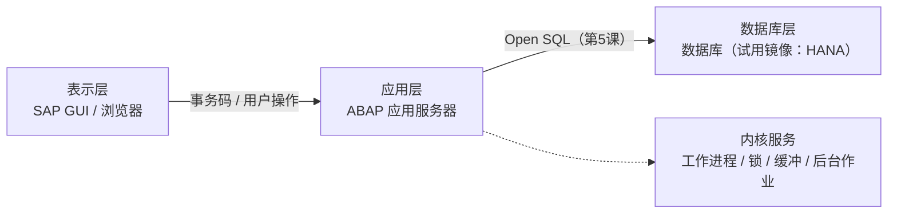

# 第1课：SAP 系统入门与开发环境

> 45分钟 | 阶段：基础篇 | 建议边读边操作

## 前置依赖

- 第0课[环境就绪清单](00-getting-started.md#环境就绪清单)已通过：能登录系统，SFLIGHT 系列表有数据。

## 问题引入

你即将开发一个航班管理系统——但你的代码要运行在哪里？SAP 系统长什么样？你连登录界面都没见过，怎么开始写代码？本课带你第一次"走进"SAP：登录、认界面、用事务码导航、亲手查出第一张表的数据。

## 时间安排

| 时段 | 内容 | 时长 |
|------|------|------|
| 场景引入 | 为什么学 SAP / SAP 在企业中的角色 | 3 分钟 |
| Demo 跟做 | 登录系统，分步浏览 SFLIGHT 航班数据 | 12 分钟 |
| 知识讲解 | SAP 架构、GUI 操作、事务码导航、查表技巧 | 23 分钟 |
| 知识总结 | 关键事务码速查表、常用操作清单 | 5 分钟 |
| 课后思考 | 自由练习 | 2 分钟 |

## 本课目标

完成本课你将能够：

- 说清 SAP 三层架构各层的职责；
- 独立使用命令栏在事务码之间导航，管理多个会话；
- 用 SE16 查任意表的数据（含条件筛选、通配符、数量限制）；
- 用 F1 技术信息反查"屏幕上这个字段存在哪张表"；
- 用 SE11 阅读一张表的结构（字段、主键、外键、索引）。

## Demo：第一次走进 SAP（分步跟做）

> 📸 本课配图将在课程录制阶段补充，位置以注释标出；先照文字步骤操作，完全可行。

### 步骤 1：登录系统

打开 SAP GUI，选中第0课创建的连接（试用镜像：应用服务器 `localhost`、实例号 `00`、系统 ID `A4H`），输入用户名和密码登录。

**你会看到什么：** 登录成功后进入 **SAP Easy Access**——这就是你今后每天面对的"主屏幕"。

### 步骤 2：认识 SAP Easy Access 界面

<!-- 配图（待截图后启用）： -->

从上到下四个区域，认清它们，所有 SAP 屏幕都通用：

| 区域 | 位置 | 用途 |
|------|------|------|
| 菜单栏 | 最顶端 | 当前事务的完整菜单 |
| 标准工具栏 | 第二行 | 保存（Ctrl+S）、返回（F3）、退出（F12）、执行（F8）、取消（F12）等全局按钮 |
| 命令栏 | 左上角输入框 | **最重要的区域**：输入事务码直接跳转 |
| 状态栏 | 最底部 | 系统名、Client、响应时间、消息提示 |

左侧的树是**菜单树**：SAP 标准菜单按功能组织了全部事务码——但没人真的靠点菜单工作，记住常用事务码、敲命令栏才是日常。

!!! warning "环境差异"

    试用镜像的菜单树比公司系统精简得多（它只装了技术栈，没装业务模块）。在客户现场你会看到庞大得多的菜单树，但开发用的事务码是同一套——本文教的命令栏方式不受影响。

### 步骤 3：用 SE16 查第一家航空公司

<!-- 配图（待截图后启用）： -->

1. 在命令栏输入 `SE16` 回车（或 `/nSE16` 强制从任意界面返回初始屏幕再进入）；
2. Data Browser 界面的 Table 字段输入 `SCARR`，回车；
3. 界面切换为**选择条件屏幕**——每个字段都是筛选条件，现在全空 = 查全表；
4. 点左上角**执行按钮（F8）** 或直接按 `F8`。

<!-- 配图（待截图后启用）： -->

**你会看到什么：** 结果列表列出全部约 15 家航空公司——`AA` 美国航空、`LH` 汉莎航空、`QF` 澳洲航空……这就是第0课生成的 SFLIGHT 数据模型的"航空公司"维表。

**两个立刻要会的小操作：**

- **双击任意一行**：进入单条记录明细视图，以表单形式展示该行所有字段；
- **返回上一层**：按 `F3`（标准工具栏的绿色返回箭头）。

### 步骤 4：带条件查航班表

SE16 里在命令栏输入 `/nSE16` 重新开始，这次查 `SFLIGHT`（航班表，数据量上万条）：

1. Table 字段填 `SFLIGHT`，回车进入选择屏幕；
2. 在 `Carrid`（航空公司代码）条件栏填 `AA`；
3. 在屏幕上方的 **Maximum no. of hits**（最大命中数）填 `10`——查大表前先限量的好习惯；
4. F8 执行。

**你会看到什么：** 美国航空 AA 的前 10 个航班记录，每行是一个"某天某航线的一次飞行"，包含日期（FLDATE）、票价（PRICE）、座位数（SEATSMAX/SEATSOCC）等。

**试试通配符：** 回到选择屏幕，把 Carrid 条件改成 `A*`（以 A 开头的所有航空公司）再执行，对比结果差异。

### 步骤 5：F1 反查"这个字段存在哪张表"

这是 SAP 开发者命中率最高的技巧之一：

1. 在 SE16 的 SFLIGHT 选择屏幕上，把光标放在任意字段上（比如 Carrid）；
2. 按 `F1`（或右键 → 帮助），弹出字段级文档；
3. 点弹窗里的 **技术信息（Technical Information）** 按钮。

<!-- 配图（待截图后启用）： -->

**你会看到什么：** 一张"身份证"——透明表名（Table）、字段名（Field name）、数据元素（Data element）、域（Domain）一应俱全。以后在业务屏幕上看到任何字段，想知道它存哪，F1 一按就知道。

### 步骤 6：SE11 阅读表结构

<!-- 配图（待截图后启用）： -->

1. 命令栏输入 `SE11`，Dictionary 初始屏幕选择 **Database table**，填 `SCARR` 回车；
2. 展示屏幕分区块：**字段列表（Fields）**、**外键（Foreign Keys）**、**索引（Indexes）**；
3. 点字段列表右上角的 **内容（Contents）** 按钮可以直接跳到 SE16 查数据——两个工具是打通的。

**读什么：** 字段名、键列（Key）打勾的就是主键（SCARR 的主键是 CARRID）、每列的数据元素和类型长度。第三课你会自己建一张这样的表，现在是先学会"读"。

## 知识点

### 1. SAP 三层架构

- **表示层**：你刚操作的 SAP GUI，只负责展示和收集输入，不含业务逻辑；
- **应用层**：ABAP 程序真正运行的地方——你写的所有代码都在这层执行；
- **数据库层**：数据的最终归宿，应用层通过 Open SQL 访问它，不直接碰数据库方言。

!!! tip "落地理解"

    第0课部署的 Docker 试用镜像，本质就是**把这三层打包进了一个容器**：容器里同时跑着应用服务器和 HANA 数据库，你的 SAP GUI 是容器外的表示层。公司生产环境则会把三层拆到独立的服务器集群上。

### 2. Client（客户端）概念

同一个 SAP 系统里用三位数字划分出互相隔离的"逻辑租户"：

| Client | 用途 | 你会用到吗 |
|--------|------|-----------|
| 000 | 系统管理 | 几乎不 |
| 001 | 开发/演示 | **日常都用它**（试用镜像的 DEVELOPER 用户） |

所有业务表数据都带 Client 字段（首字段 MANDT），不同 Client 的数据天然隔离——这就是为什么写 SQL 时 `WHERE mandt = sy-mandt` 是系统自动处理的（第5课展开）。

### 3. 什么是事务码（T-Code）

SAP 里每个功能界面都有一个**事务码（Transaction Code）**——一串不超过 20 位的字母数字代号，在命令栏输入它就能直达对应功能，免去在菜单树里层层翻找。

事务码本质上是一条**快捷方式**（定义存放在 TSTC 表里），背后绑定了：

- 一个 **ABAP 程序**——功能的真正实现者；
- 程序的**初始屏幕**——从哪一屏开始。

比如 `SE16` 不是魔法咒语，它只是"数据浏览器程序"的代号。开发者之间交流也用事务码："你去 SE11 看下那张表"。

**命令栏的四种写法（今天起天天用）：**

| 写法 | 效果 |
|------|------|
| `SE16` | 在当前窗口进入该事务 |
| `/nSE16` | 无论当前卡在哪个界面，**强制取消当前事务**、从初始屏幕进入——最稳妥的写法 |
| `/oSE16` | **新开会话窗口**进入，原窗口保留（最多 6 个会话） |
| `/*` | 搜索事务码（记不全代号时用） |

**迷路了怎么知道自己在哪？** 菜单 **系统（System）→ 状态（Status）**，弹窗里的 Tcode（当前事务码）和 Program（当前程序）一目了然——这个弹窗以后调试时还会反复用到。

!!! tip "验明正身"

    事务码 = TSTC 表里的一条记录——这不马上就能验证了吗？SE16 查 TSTC 表、条件 TCODE = `SE16`，看看数据浏览器背后绑定的程序叫什么名字。（答案见课后思考第 5 题，去评论区对一对。）

顺带一提：查看和维护事务码定义的专门工具是 **SE93**，第24课综合实战时我们会给自己的程序创建专属事务码，现在混个脸熟即可。

### 4. 开发五件套

认识了事务码，下面这五个是开发者的每日必用：

| 事务码 | 名称 | 用途 | 本课地位 |
|--------|------|------|---------|
| SE16 | Data Browser | 查表数据 | ✅ 已上手 |
| SE11 | ABAP Dictionary | 看表结构、建表 | ✅ 已上手 |
| SE38 | ABAP Editor | 写报表程序 | 第2课主场 |
| SE80 | Object Navigator | 按包浏览全部开发对象 | 第3课起常用 |
| SE37 | Function Builder | 函数模块 | 第9课主场 |

SU01（用户管理）在试用镜像里基本用不到，知道有这回事即可。

!!! warning "环境差异：SE16 与 SE16N"

    公司的 ECC/S4 系统里更常用 **SE16N**（新一代数据浏览器，ALV 界面、支持更多操作）；**试用镜像只有 SE16**。本课程统一以 SE16 演示，操作逻辑两者一致，学会一个到哪个环境都能用。

### 5. 查表技巧清单

- **通配符**：`*` 匹配任意字符串，`+` 匹配单个字符（`A*`、`+A*`）；
- **最大命中数（Maximum no. of hits）**：默认 200，查未知规模的表保持默认或更低，别清空；
- **排序**：结果列表双击列标题快速排序；
- **多条件**：同一字段的多个值分行填写（隐含 OR），不同字段之间是 AND。

### 6. SE11 的另外三件武器

- **外键（Foreign Keys）**：看字段引用了哪张主表——SFLIGHT 的 CARRID 外键指向 SCARR，这就是表间关系的"合同"；
- **索引（Indexes）**：主键索引之外的自建索引，决定查询性能（第5课性能话题的基础）；
- **Where-Used List**：右键字段或表选"使用清单"，看哪些对象在用它——研究标准代码的入口。

### 7. 收藏夹

- Easy Access 左侧右键任意菜单项 → **添加到收藏夹**，常用事务码收进 Favorites；
- 收藏夹支持文件夹分组和拖拽排序——建议现在就把开发五件套收进去，从此不依赖菜单树。

### 8. 开发对象与 Package

SAP 里一切开发产物（程序、表、类……）都必须归属一个**开发包（Package）**，包决定对象存在哪、传输到哪：

- 本课程的包是 `ZABAP_COURSE`（第0课创建）；
- 本地对象包 `$TMP` 里的东西**无法传输**——abapGit 也挂不上它（第0课踩过的坑）；
- 包 → 传输请求 → 传输路径的完整机制是第17课的主场，现在只要建立"对象必有归属"的意识。

## 代码

本课无代码，纯系统操作。

## 💡 实战经验

!!! tip "事务码记不住怎么办"

    命令栏输入 `/*` 开头可以搜索事务码；更实用的做法是把常用的加进收藏夹，以及——用多了自然就记住了，开发五件套一个星期就刻进肌肉记忆。

!!! tip "F1 是你最好的老师"

    任何屏幕、任何字段，F1 → 技术信息，表名/字段名/数据元素全部现形。研究标准系统的第一步永远从 F1 开始。

!!! tip "查大表先限量"

    SE16 的最大命中数**默认限制是 200**，这是系统自带的保护，别随手清空。生产系统一张表动辄千万行，全量查询轻则等半天，重则拖垮系统——默认的 200 足够看数据样本，确认量级时再有意识地放宽。

!!! tip "多会话是刚需"

    `/oSE38` 新窗口开编辑器、原窗口留着 SE16 随时核对数据——这是开发者的标准姿势，从今天开始用。

## 📖 延伸阅读

- [Flight Model——本课程贯穿数据的官方出处](https://help.sap.com/docs/SAP_NETWEAVER_700/12a2d87e6c531014bec0e63ea0208c21/cf21f304446011d189700000e8322d00.html)（SAP Help Portal）
- [SAP Help Portal](https://help.sap.com) / [SAP Community](https://community.sap.com)——遇到任何报错，先搜这两个地方
- 更多资料见[参考资料库](references.md)，随课程持续扩充

## 课后思考

> 下面的问题**不提供标准答案**——把你的回答写在**本页底部的评论区**，注明题号。写出来的过程就是梳理知识的过程，你的答案也会帮到后来的同学，我会在评论区参与讨论。

1. SFLIGHT 模型中有哪些表？它们之间是什么关系？（提示：SE11 看外键）
2. 如何快速查找一个字段属于哪张表？说出完整操作路径。
3. 在 SE11 中查看 SCARR 表：它的主键是什么？数据元素和域分别是什么，各承担什么职责？
4. 用 SE16 统计：航空公司 LH 在 `SFLIGHT` 里有多少个航班？（试试 Carrid 填 `LH` + 最大命中数策略，评论区聊聊你的数法）
5. 用 SE16 查 `TSTC` 表（条件 TCODE = `SE16`）：SE16 这个事务码背后绑定的程序叫什么名字？这条记录里还能看到什么信息？

---

下一课：[第2课：Hello World 与基本数据类型](02-hello-world.md)——在 SE38 里写下你的第一个 ABAP 程序。
