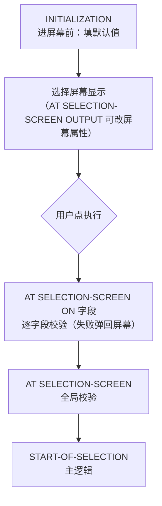

# 第7课：选择屏幕

> 45分钟 | 阶段：核心篇 | 建议边读边做

## 前置依赖

- [第5课](05-open-sql.md)：会带条件的 SELECT。

## 问题引入

跑报表前，领导说"只看 LH 的、上个月的、座位占用超过 100 的航班"。你不可能为每种组合写一个程序——**选择屏幕**就是 ABAP 报表的标准入口：用户填条件，程序按条件查。本课做出第一个"像样的"交互式报表：带默认值、必填校验、日期区间和数量筛选。

## 时间安排

| 时段 | 内容 | 时长 |
|------|------|------|
| 场景引入 | 为什么需要选择屏幕 | 3 分钟 |
| Demo 跟做 | 运行 + 体验筛选 + 制造一次校验报错 | 10 分钟 |
| 代码拆解 | PARAMETERS / SELECT-OPTIONS / 事件链 / 校验 | 24 分钟 |
| 知识总结 | 组件速查表、事件时序图 | 6 分钟 |
| 课后思考 | 练习 | 2 分钟 |

## 本课目标

完成本课你将能够：

- 用 PARAMETERS 做单值输入（含 OBLIGATORY / DEFAULT / 复选框 / 单选组）；
- 用 SELECT-OPTIONS 做区间/多值/排除等复杂筛选，理解其四段结构（SIGN/OPTION/LOW/HIGH）；
- 说清选择屏幕的**事件时序**：INITIALIZATION → 显示 → 字段校验 → START-OF-SELECTION；
- 在 AT SELECTION-SCREEN 事件里做输入校验并用 MESSAGE 拦截。

## Demo：航班条件查询（分步跟做）

程序 `zac_selection_screen` 已随仓库下发，SE38 运行：

```abap
REPORT zac_selection_screen.

SELECTION-SCREEN BEGIN OF BLOCK b1 WITH FRAME TITLE '航班查询条件'.
PARAMETERS: p_carrid TYPE sflight-carrid OBLIGATORY DEFAULT 'AA'.
SELECT-OPTIONS: s_connid FOR sflight-connid NO-EXTENSION,
                s_date   FOR sflight-fldate,
                s_seats  FOR sflight-seatsocc.
SELECTION-SCREEN END OF BLOCK b1.

AT SELECTION-SCREEN ON p_carrid.
  SELECT SINGLE carrid FROM scarr INTO @DATA(lv_check)
    WHERE carrid = @p_carrid.
  IF sy-subrc <> 0.
    MESSAGE e001(zac_flight_msg) WITH p_carrid.  " 航空公司代码 &1 不存在
  ENDIF.

START-OF-SELECTION.
  SELECT carrid, connid, fldate, seatsmax, seatsocc, price
    FROM sflight
    WHERE carrid = @p_carrid
      AND connid IN @s_connid
      AND fldate IN @s_date
      AND seatsocc IN @s_seats
    INTO TABLE @DATA(lt_sflight).

  IF lt_sflight IS INITIAL.
    WRITE: / '未找到符合条件的航班'.
  ELSE.
    LOOP AT lt_sflight INTO @DATA(ls).
      WRITE: / |{ ls-carrid } { ls-connid } { ls-fldate } 座位 { ls-seatsocc }/{ ls-seatsmax }|.
    ENDLOOP.
    WRITE: / |共 { lines( lt_sflight ) } 条记录|.
  ENDIF.
```

**跟做三步：**

1. 直接 F8（默认值 AA）→ 看到全部 AA 航班；
2. 展开日期区间填 `2026-01-01 ~ 2026-12-31`，已占座位选 GreaterThan 填 `100` → F8，看结果收窄；
3. 把航空公司改成 `ZZ` → F8 → **状态栏红字"航空公司代码 ZZ 不存在"，程序拒绝往下走**——字段级校验在工作。

<!-- 配图（待截图后启用）： -->

## 知识点

### 1. PARAMETERS：单值输入

```abap
PARAMETERS p_carrid TYPE sflight-carrid OBLIGATORY DEFAULT 'AA'.
PARAMETERS p_show   AS CHECKBOX DEFAULT 'X'.                  " 复选框
PARAMETERS p_mode   TYPE c RADIOBUTTON GROUP g1 DEFAULT 'X'.  " 单选组
PARAMETERS p_hide   NO-DISPLAY.                               " 隐形参数
```

| 附加项 | 作用 |
|--------|------|
| `OBLIGATORY` | 必填（留空点执行直接拦） |
| `DEFAULT` | 默认值 |
| `AS CHECKBOX` | 布尔（`'X'`/`' '`） |
| `RADIOBUTTON GROUP g1` | 同组互斥 |
| `NO-DISPLAY` | 不显示，但可被 SUBMIT/变式传值 |
| `MATCHCODE OBJECT` | 挂搜索帮助（F4） |
| `VALUE CHECK` | 对照检查表验值 |

### 2. SELECT-OPTIONS：区间输入——本课的主角

屏幕上它是一行"从…到…"+ 扩展按钮；程序里它是一个**内表**，每行四段：

| 字段 | 含义 | 常见值 |
|------|------|--------|
| SIGN | 包含/排除 | `I`（Include）/ `E`（Exclude） |
| OPTION | 比较方式 | `EQ` / `BT`（区间）/ `GT` / `NE` / `CP`（通配）… |
| LOW | 低值/单值 | — |
| HIGH | 高值（仅 BT） | — |

用户在屏幕上的每次"添加行"，就是往这个内表加一行规则；**空 select-option = 零行 = 不限制**（Demo 里 s_seats 不填就是全量）。SQL 侧直接 `WHERE seatsocc IN @s_seats`，运行时自动展开成 SQL 条件——选择屏幕和 Open SQL 的天作之合。

常用附加项：`NO-EXTENSION`（禁止多行）、`NO INTERVALS`（只单值无区间）、`DEFAULT`（可给到 SIGN/OPTION/LOW/HIGH 全套）、`MEMORY ID`（跨程序记忆输入）。

### 3. 事件时序：谁先谁后



- **校验越早越好**：字段级校验放 `ON p_carrid`（错误贴着字段），跨字段一致性放全局 `AT SELECTION-SCREEN`；
- **MESSAGE e** 在校验事件里 = 拦下执行、弹回屏幕；`MESSAGE s` = 状态栏提示不拦截——校验用 E，提示用 S（第18课展开）；
- `AT SELECTION-SCREEN OUTPUT` 是选择屏幕的 PBO（显示前处理），可动态隐藏/灰化字段。

### 4. 行级校验：`AT SELECTION-SCREEN ON END OF s_date`

`ON p_carrid` 是**字段级**校验——整个字段填完校验一次。SELECT-OPTIONS 还有更细的一档：用户在**多值选择对话框**（点选择项行尾的箭头按钮）里每确认一行，就触发一次 `ON END OF`：

```abap
AT SELECTION-SCREEN ON END OF s_date.
  " 此时 s_date 内表只装着用户刚确认的这一行
  IF s_date-high IS NOT INITIAL AND s_date-low > s_date-high.
    MESSAGE '日期区间下限不能大于上限' TYPE 'E'.
  ENDIF.
```

- 与 `ON field` 的分工：`ON field` 管"整个选择项的最终状态"（用户关掉对话框、点执行时验一遍）；`ON END OF` 管"每一行进内表之前的即时体检"——错误当场拦在当前行，不用等用户填完全部再回头找；
- 事件里的 `s_date` **只含当前这一行**，别当全表 LOOP；E 消息把用户打回该行重填，体验与 `ON field` 一致；
- 典型用途：单行 LOW > HIGH、区间跨度过大（如日期区间不许超一年）、单值不许为空等"一行之内就能判定"的规则。

### 5. 布局：BLOCK 分组与文本

```abap
SELECTION-SCREEN BEGIN OF BLOCK b1 WITH FRAME TITLE '航班查询条件'.
  ...
SELECTION-SCREEN END OF BLOCK b1.
```

块 + 框架标题让参数不散架；多组参数（主条件/显示选项/调试开关）分块是报表标配。屏幕元素的中文标签走正道：菜单 **Goto → Text Elements → Selection Texts**（把 `P_CARRID` 显示为"航空公司"）。

### 6. 多值对话框与 %_OPTIONS（简要）

SELECT-OPTIONS 行尾那个箭头按钮（内部功能码 `%_OPTIONS`）点开的就是上一节提到的**多值选择对话框**：四个页签分别维护"单值包含 / 区间包含 / 单值排除 / 区间排除"，每页签可填多行。用户在页签间切换的"包含/排除、单值/区间"，落到程序里就是每行的 SIGN 与 OPTION——第 2 节的四段结构，用户侧的完整操作界面就是它。条件生效后按钮会变绿，一眼看出"这行有附加限制"。

!!! tip "不想要多值就砍掉它"

    `NO-EXTENSION` 会把 `%_OPTIONS` 按钮整个拿掉（Demo 的 `s_connid` 就是这么干的），`NO INTERVALS` 再砍掉 HIGH 列——条件越简单，用户越不容易填错，你也越少写防御代码。

## 💡 实战经验

!!! tip "校验永远做在选择屏幕事件里"

    把校验写进 `START-OF-SELECTION` 再报错，用户体验割裂；`AT SELECTION-SCREEN ON 字段` 校验失败停在原屏幕、错误信息贴字段——这是 SAP 用户几十年的肌肉记忆，别打破。

!!! tip "高频查询给 DEFAULT"

    把使用者最常见的条件做成默认值（如默认当月区间），一行 DEFAULT 换每天少点十次。

!!! warning "别手工拆 SELECT-OPTIONS"

    有人爱 LOOP 着 `s_date` 手拼 WHERE——没必要，`IN @s_date` 原生支持。确需加工（如整体加一天）再操作内表，改完照样 IN。

## 📖 延伸阅读

- [ABAP Keyword Documentation](https://help.sap.com/doc/abapdocu_752_index_htm/7.52/en-US/index.htm)——`PARAMETERS` / `SELECT-OPTIONS` / `SELECTION-SCREEN` 条目。

## 课后思考

> 把你的回答写在**页面底部评论区**，注明题号，一起讨论。

1. PARAMETERS 和 SELECT-OPTIONS 的本质区别？（提示：程序里它们各是什么类型？）
2. 用户在选择屏幕上"排除 0017 航线"对应 SELECT-OPTIONS 内表里一行什么数据？
3. 给 Demo 加复选框"只看满员航班"（`p_full AS CHECKBOX`）并让 SQL 生效——把你的 WHERE 写法贴出来。
4. 校验写在 `AT SELECTION-SCREEN ON p_carrid` 与写在 `START-OF-SELECTION` 开头，用户体验差在哪？

---

下一课：[第8课：数据格式化](08-formatting.md)
