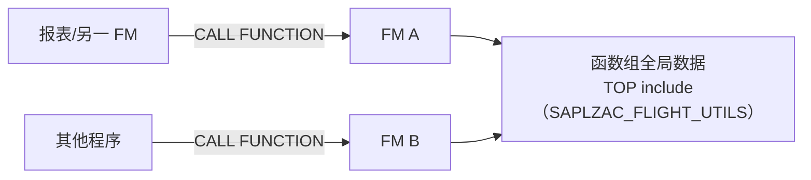

# 第9课：Function Module（函数模块）

> 45分钟 | 阶段：核心篇 | 建议边读边做

## 前置依赖

- [第5课](05-open-sql.md)：会 SELECT；
- [第4课](04-internal-table.md)：结构体与内表。

## 问题引入

"计算航线飞行时长"的逻辑写在一个报表里，另一个报表也要用——复制粘贴？以后逻辑一改就得改两处，迟早漏。ABAP 传统世界的答案叫 **Function Module（FM，函数模块）**：把逻辑封装成可复用的调用单元，全系统唯一命名、参数明确、可单测、可远程调用。SAP 自己的几万个标准 FM（包括第14课要上手的 BAPI）都是这套体系。

!!! note "本课对象尚未随仓库下发"

    调用程序 `zac_call_function` 已随仓库下发；函数组 `zac_flight_utils` 与 FM `zac_calc_flight_duration` 的完整参考源码见仓库 [`ref-source/zac_flight_utils/`](https://github.com/Jack-Liang/abap-course/tree/master/ref-source/zac_flight_utils)——函数组请按下面步骤在 SE37 手工创建（过程本身就是本课教学内容），对照参考源码粘贴即可。

    这是[第0课第四节](00-getting-started.md#四命名规范与对象对照)说过的例外：这组对象的名字**必须照抄** `zac_`（`zac_call_function` 按名调用 FM），但包照旧放你的个人练习包。

## 时间安排

| 时段 | 内容 | 时长 |
|------|------|------|
| 场景引入 | 复用需求 / 复制粘贴的代价 | 3 分钟 |
| Demo 跟做 | 建函数组 → 建 FM → SE37 单测 → 报表调用 | 12 分钟 |
| 代码拆解 | 参数四方向 / 异常 / 函数组内存 / RFC 概念 | 22 分钟 |
| 知识总结 | FM vs 方法对比、SE37 速查 | 5 分钟 |
| 课后思考 | 练习 | 3 分钟 |

## 本课目标

完成本课你将能够：

- 说清 Function Group 与 Function Module 的关系（容器与成员）；
- 在 SE37 中创建 FM，正确设计 Import/Export/Changing/Tables/Exceptions；
- 用 `CALL FUNCTION` 按名传参调用并在 SE37 测试环境单独执行 FM；
- 区分经典 EXCEPTIONS 异常与现代基于类的异常；
- 理解 RFC 是什么、SM59 的角色（为第16课铺垫）。

## Demo：做一个飞行时长计算 FM（分步跟做）

### 步骤 1：创建 Function Group

1. SE37 → 菜单 **Goto → Function Groups → Create Group**；
2. Group 名 `zac_flight_utils`，Short text `航班工具函数组`；
3. 保存到**个人练习包**并激活（练习包放哪不影响调用——FM 按名解析，仓库程序 `zac_call_function` 找的是 FM 的名字，不是它所在的包）。函数组是 FM 的"容器"，本质是一个自动生成的程序（SAPL + 组名），组内 FM 共享它的全局数据区。

### 步骤 2：创建 Function Module

1. SE37 主屏输入 FM 名 `zac_calc_flight_duration` → Create；
2. Function Group 填 `zac_flight_utils`，Short text `计算航线飞行时长`；
3. **Import 页签**：

| Parameter | Type | Pass Value | Optional |
|-----------|------|-----------|----------|
| IV_CARRID | `S_CARR_ID` | ✔ | |
| IV_CONNID | `S_CONN_ID` | ✔ | |

4. **Export 页签**：

| Parameter | Type |
|-----------|------|
| EV_FOUND | `ABAP_BOOL` |
| EV_DURATION_MIN | `I` |
| EV_DISTANCE | `S_DISTANCE` |
| EV_CITYFROM | `S_FROM_CIT` |
| EV_CITYTO | `S_TO_CIT` |

5. **Exceptions 页签**：`NOT_FOUND`；
6. 源代码区写入实现：

```abap
FUNCTION zac_calc_flight_duration.
*"----------------------------------------------------------------------
*"*"Local Interface:
*"  IMPORTING
*"     VALUE(IV_CARRID) TYPE  S_CARR_ID
*"     VALUE(IV_CONNID) TYPE  S_CONN_ID
*"  EXPORTING
*"     VALUE(EV_FOUND)       TYPE  ABAP_BOOL
*"     VALUE(EV_DURATION_MIN) TYPE  I
*"     VALUE(EV_DISTANCE)    TYPE  S_DISTANCE
*"     VALUE(EV_CITYFROM)    TYPE  S_FROM_CIT
*"     VALUE(EV_CITYTO)      TYPE  S_TO_CIT
*"  EXCEPTIONS
*"      NOT_FOUND
*"----------------------------------------------------------------------
  SELECT SINGLE deptime, arrtime, distance, cityfrom, cityto
    FROM spfli
    WHERE carrid = @iv_carrid AND connid = @iv_connid
    INTO @DATA(ls_spfli).

  IF sy-subrc = 0.
    ev_cityfrom     = ls_spfli-cityfrom.
    ev_cityto       = ls_spfli-cityto.
    ev_distance     = ls_spfli-distance.
    " TIMS 是 HHMMSS 数字串，直接相减会错位——先拆出时分各自换算成分钟
    ev_duration_min = ( ls_spfli-arrtime(2) * 60 + ls_spfli-arrtime+2(2) )
                    - ( ls_spfli-deptime(2) * 60 + ls_spfli-deptime+2(2) ).
    ev_found        = abap_true.
  ELSE.
    RAISE not_found.
  ENDIF.
ENDFUNCTION.
```

7. 激活。

### 步骤 3：SE37 单测——不写调用方先验证

工具栏 **Test/Execute（F8）**：弹出参数输入屏，IV_CARRID 填 `AA`、IV_CONNID 填 `0017` → 执行。

**你会看到什么：** 返回屏列出所有 Export 值——`EV_CITYFROM = NEW YORK`、`EV_CITYTO = SAN FRANCISCO`、`EV_DURATION_MIN = 181`（起降时刻 11:00 → 14:01，差 3 小时 01 分 = 181 分钟。注意它不等于 SPFLI 里的计划飞行时长 `FLTIME = 361`——那是官方按跨时区航线另行维护的值，本 FM 算的是起降时刻差，两者不同很正常）。**改参数再跑，秒级反馈，这就是 FM 的单元测试。**再试 `ZZ/9999`，确认走进 NOT_FOUND 异常。

### 步骤 4：报表调用

SE38 新建 `zac_call_function`（或等仓库下发）：

```abap
REPORT zac_call_function.

START-OF-SELECTION.
  " 出参显式声明接收——CALL FUNCTION 里的 DATA(...) 内联声明是 7.52+ 语法，
  " 7.40/7.50 环境会报 "inline declaration not possible in this position"
  DATA: lv_found      TYPE abap_bool,
        lv_minutes    TYPE i,
        lv_distance   TYPE s_distance,
        lv_cityfrom   TYPE s_from_cit,
        lv_cityto     TYPE s_to_cit.

  CALL FUNCTION 'ZAC_CALC_FLIGHT_DURATION'
    EXPORTING
      iv_carrid       = 'AA'
      iv_connid       = '0017'
    IMPORTING
      ev_found        = lv_found
      ev_duration_min = lv_minutes
      ev_distance     = lv_distance
      ev_cityfrom     = lv_cityfrom
      ev_cityto       = lv_cityto
    EXCEPTIONS
      not_found       = 1
      OTHERS          = 2.

  IF sy-subrc <> 0.
    WRITE: / '未找到航线信息'.
  ELSE.
    WRITE: / |{ lv_cityfrom } → { lv_cityto }|.
    WRITE: / |飞行时长: { lv_minutes } 分钟, 距离: { lv_distance }|.
  ENDIF.
```

## 知识点

### 1. 参数的四个方向 + 异常

| 方向 | 语义 | 备注 |
|------|------|------|
| IMPORTING | 调用者 → FM | 入参 |
| EXPORTING | FM → 调用者 | 出参（调用侧写在 IMPORTING 里——方向按 FM 视角命名） |
| CHANGING | 双向 | 进出都带值，内表常用 |
| TABLES | 旧式内表参数 | **已过时**：新 FM 用 CHANGING + 标准内表类型替代 |
| EXCEPTIONS | 经典异常 | `RAISE xxx` + 调用侧 `EXCEPTIONS xxx = 1`，靠 sy-subrc 判断 |

- **Pass Value 勾选**（VALUE() 传值）：参数复制一份进出，FM 内改动不影响调用者；不勾是引用语义。小结构勾不勾无所谓，大内表传值有拷贝成本——经典性能坑；
- 经典异常之外，新代码推荐**基于类的异常**（`RAISING cx_static_check` 子类 + TRY/CATCH，第13课展开）：异常是对象，能带上下文信息，不止一个返回码。

### 2. 函数组：共享的全局数据区



- 同组 FM **共享全局数据**——跨 FM 传递状态是它的设计用途，也是最大隐患（调用顺序改变结果）；
- 经验法则：全局数据只放"只读的缓存/配置"，可变状态一律走参数；
- 一个函数组放一组**高内聚**的 FM（如本组就叫"航班工具"），别做成大杂烩。

### 3. CALL FUNCTION 的调用范式

```abap
CALL FUNCTION 'ZAC_CALC_FLIGHT_DURATION'
  EXPORTING
    iv_carrid = 'AA'          " 按参数名传值（推荐，顺序无关）
  IMPORTING
    ev_...    = DATA(...)     " 内联声明接收（7.52+；旧版本需先 DATA 显式声明）
  EXCEPTIONS
    not_found = 1
    OTHERS    = 2.            " sy-subrc 映射
```

- 参数名传值是标准姿势（屏幕上是灰底系统自动带出，敲参数名快选）；
- 调用后**先看 sy-subrc 再用 EXPORT 值**——异常路径下的出参是垃圾值。

### 4. RFC：给 FM 插上远程翅膀

- **RFC（Remote Function Call）**：FM 在属性页签勾选 **Remote-Enabled**，就能被**另一个系统**通过 RFC Destination 调用；
- SM59 维护目标系统连接（主机/账号/认证）；调用侧语法多一句 `DESTINATION 'xxx'`；
- **BAPI 就是 RFC-enabled 的 FM + SAP 官方接口规范**——第14课的主角，谜底今天先揭晓一半；
- 同系统调用别绕 RFC（网络往返开销大），它是跨系统集成专用（第16课深化）。

## 💡 实战经验

!!! tip "先 SE37 单测，再接调用方"

    FM 的最大工程红利是可独立测试：F8 填参数看输出，10 秒一轮。先把 FM 测对，再写调用方——比"改一行报表跑一遍"快一个数量级。

!!! warning "全局数据是共享的，真的"

    函数组全局变量在**同组 FM 间共享且跨调用留存**（同一 LUW 内状态可能"粘住"）。见过生产事故模式：FM A 设了全局标记，FM B 读它做分支——换个调用顺序，结果就变。可变状态走参数，全局区只放只读。

!!! tip "TABLES 参数见到就替换"

    维护老 FM 时遇到 TABLES 参数，新增逻辑尽量用 CHANGING/IMPORTING-内表实现；TABLES 带表头行的语义是历史包袱，新代码不要引入。

## 📖 延伸阅读

- [ABAP Keyword Documentation](https://help.sap.com/doc/abapdocu_752_index_htm/7.52/en-US/index.htm)——`FUNCTION` / `CALL FUNCTION` / `RAISE` 条目；
- BAPI 与 RFC 的官方资料见[参考资料库](references.md)（第14课延伸区将补充 BAPI Explorer 链接）。

## 课后思考

> 把你的回答写在**页面底部评论区**，注明题号，一起讨论。

1. Function Module 和 FORM 子例程（PERFORM）都能复用代码，本质区别有哪些？（至少说出三点）
2. EXPORTING（FM 视角）为什么写在调用方的 IMPORTING 里？"按 FM 视角命名"的好处是什么？
3. 动手：创建 FM `zac_count_flights`（Import: IV_CARRID；Export: EV_COUNT），统计某航空公司的航班数——把你的 SELECT 语句贴出来。
4. 经典 EXCEPTIONS 异常和基于类的异常（RAISING）各适合什么场景？

---

下一课：[第10课：ALV 报表（基础）](10-alv-basic.md)
