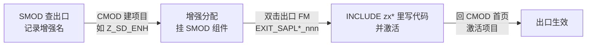
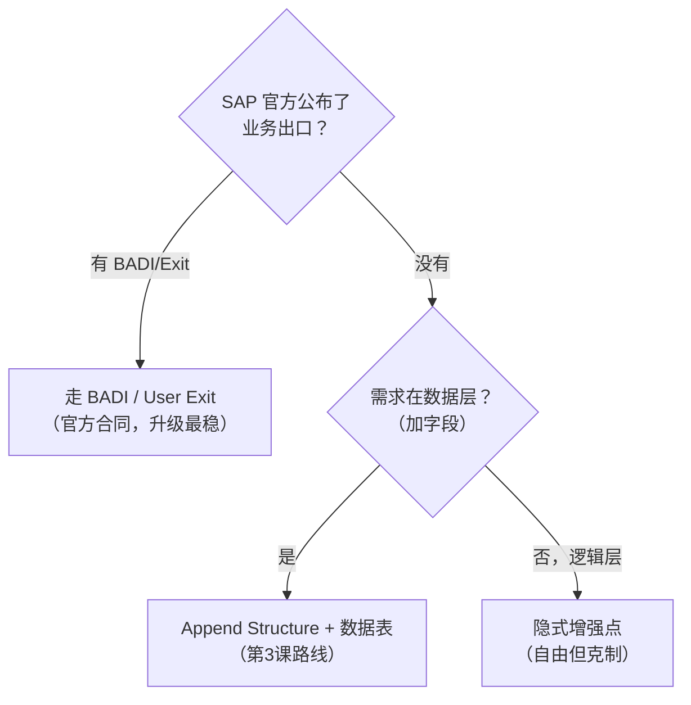

# 第15课：增强（Enhancement）—— 不改标准代码扩展功能


> 45分钟 | 阶段：高级篇 | 概念+操作课

## 前置依赖

- [第9课](09-function-module.md)：FM 概念；
- [第13课](13-oo-basic.md)：接口与实现（BADI 的语言基础）；
- [第3课](03-data-dictionary.md)：`zac_flight_ext` 表（本课 Demo 的数据主角）。

## 问题引入

标准程序 99% 贴合需求，就差 1%："输出里想带上我们自建的备注字段"。标准代码**永远不能改**（升级即丢、SAP 不再支持）——这 1% 怎么补？答案是**增强（Enhancement）**：SAP 在标准代码里预留了"注入口"，你的代码从这些口子注入，与标准代码共存且升级不丢。本课看懂增强版图、上手隐式增强点。

!!! note "本课为讲解 + 操作示范课"

    增强对象依赖具体的标准程序入口，且不同镜像的可用出口不同，课程仓库**不随发增强对象**（它是系统内配置型对象）；按 Demo 步骤在自己系统里操作即可，`zac_flight_ext`（第3课建的表）是数据载体。

## 时间安排

| 时段 | 内容 | 时长 |
|------|------|------|
| 场景引入 | 1% 差距与"不能改标准"的铁律 | 3 分钟 |
| Demo 演示 | 在标准程序隐式增强点读取 ZAC_FLIGHT_EXT | 10 分钟 |
| 知识讲解 | 四代增强技术 / 查找方法 / 取舍 | 24 分钟 |
| 知识总结 | 增强选型决策表 | 5 分钟 |
| 课后思考 | 练习 | 3 分钟 |

## 本课目标

完成本课你将能够：

- 说清"不改标准代码"原则与增强框架的存在意义；
- 区分 User Exit / BADI / Enhancement Spot / 隐式增强点四代技术；
- 在任意标准程序的隐式增强点插入自己的代码（含数据读取 `zac_flight_ext`）；
- 用断点+调用栈定位标准程序的可用注入口。

## Demo：给标准读数程序"贴"备注（操作示范）

**目标：** 在一个读取 SFLIGHT 的标准输出位置，追加我们 `ZAC_FLIGHT_EXT` 里维护的备注——标准的归标准，我们的归我们。

### 步骤 1：找一个注入口

1. SE38 打开任意会展示 SFLIGHT 的标准程序（例如数据浏览相关的报表）；
2. 命令栏输入 `/h` 再执行（第6课技能：下一动作进调试器）；
3. 调试器里看**调用栈**：找到"即将处理航班数据"的标准程序名与位置——这就是候选注入口。

### 步骤 2：插入隐式增强

1. SE38 打开该标准程序，点 **Enhance 模式按钮**（"小铅笔/增强"图标，或菜单 Edit → Enhancement Operations → Show Implicit Enhancement Options）；
2. 每个过程块首尾会出现**虚线插槽**（implicit enhancement point）；
3. 光标放到目标位置插槽 → 右键 **Enhancement Implementation → Create**，命名 `zac_sflight_remark`（课程前缀规范同样适用于增强对象）；
4. 在插槽里写代码：

```abap
" 读取课程自建的补充信息（第3课的表）
" 注意：ls_sflight 是宿主程序里的工作区——变量名以第 1 步调试器里
" 看到的为准，这里只是示例名
DATA: lv_remark TYPE zac_flight_ext-remark.

SELECT SINGLE remark FROM zac_flight_ext
  WHERE carrid = @ls_sflight-carrid
    AND connid = @ls_sflight-connid
    AND fldate = @ls_sflight-fldate
  INTO @lv_remark.

IF sy-subrc = 0.
  WRITE: / |备注: { lv_remark }|.
ENDIF.
```

5. 激活增强实现。

**你会看到什么：** 标准输出之后多出一行"备注: …"（前提是该航班在第3课的表里维护过数据）。标准代码**一个字符都没改**——升级安全。

!!! warning "隐式增强是"最后的自由"，也是最锋利的刀"

    隐式增强点几乎无处不在，意味着你几乎能在任何标准逻辑里插话——权力越大越要克制：只加不改（别 MODIFY 标准变量语义）、入口集中（一个增强实现管一类事）、写清注释说明为什么。

## 知识点

### 1. 四代增强技术版图

| 代 | 技术 | 入口形态 | 现状 |
|----|------|---------|------|
| 一代 | **User Exit**（CMOD/SMOD） | SAP 预留的 `CALL CUSTOMER-FUNCTION '001'` 调用 + 你写 EXIT 程序 | 老系统/老模块仍在用 |
| 二代 | **BADI**（SE18 定义 / SE19 实现） | 面向接口：标准代码 `GET BADI` 调接口方法，你提供实现类 | 经典主力 |
| 三代 | **Enhancement Spot/Section**（新增强框架） | 显式增强点/增强段（SAP 标记的注入口） | 现代标准 |
| 通用 | **隐式增强点** | 任意过程块首尾（上面 Demo 用的） | 自由度最高、最需克制 |

演进方向：从"SAP 预留固定出口"到"面向接口的插件体系"——BADI 的形态正是第13课的"接口 + 实现"：标准代码持接口，你交实现类。

### 2. User Exit：SMOD 查找 + CMOD 操作流程

一代 User Exit 至今在 SD/MM/FI 等老模块仍是主力出口，操作记住一句话：**SMOD 是"商店"（查有哪些出口），CMOD 是"购物车"（建项目、挂出口、激活）**。

| 事务码 | 角色 | 干什么 |
|--------|------|--------|
| **SMOD** | 出口目录 | 按模块/关键词搜索系统里全部增强定义，看文档和组件清单 |
| **CMOD** | 项目管理 | 建增强项目、挂 SMOD 增强组件、写代码、激活项目 |

**SMOD 查找小步骤：**

1. 事务码 SMOD → 增强名栏按 **F4** → 输入关键词（如 `V45*` 搜 SD 销售相关）执行；
2. 结果里点候选增强 → 看"文档"与"组件"：组件就是一排出口 FM（形如 `EXIT_SAPLaunn_nnn`），逐个读文档确认哪个出口接你的需求。

**CMOD 操作流程：**



1. **建项目**：CMOD → 输入项目名（如 `Z_SD_ENH`）→ 创建；
2. **挂增强**：点"增强分配"→ 填入 SMOD 查到的增强名 → 回车带出全部组件（一排出口 FM）；
3. **写代码**：双击目标出口 FM（形如 `EXIT_SAPLaunn_nnn`）→ 系统带你进 `INCLUDE zx*`——**代码写在 INCLUDE 里，不是改 FM 本身**；
4. **激活项目**：回 CMOD 首页点"激活"——**不激活不生效**，这是新手最常踩的坑；
5. **注意**：一个 SMOD 增强只能被一个 CMOD 项目占用——接手老系统先查"哪个项目已激活了哪个增强"。

### 3. BADI 速览（认识形态即可）

```abap
" SE18 里看到的定义（标准侧）
INTERFACE if_ex_badi_xxx.
  METHODS: check_flight CHANGING c_ok TYPE abap_bool.
ENDINTERFACE.

" SE19 里你做的：创建实现类 → 实现方法
CLASS zcl_ac_badi_impl DEFINITION.
  PUBLIC SECTION.
    INTERFACES if_ex_badi_xxx.
ENDCLASS.
" 标准代码运行到调用点时，你的实现被回调
```

经典 BADI 多实例/过滤器（一个 BADI 按条件分发多个实现）属于进阶话题，用到时查 SE18 定义即可。

### 4. Pre-Exit / Post-Exit / Overwrite：类增强的三种切入方式

改的是**标准类的方法**时，用类增强（Class Enhancement）——SE24 打开标准类 → 菜单"增强"创建增强实现，在方法上可以选三种切入：

| 切入方式 | 执行时机 | 典型场景 | 风险 |
|----------|----------|----------|------|
| **Pre-Exit** | 原方法**之前**执行 | 前置校验：参数检查，校验不过直接抛异常拦住原方法 | 低 |
| **Post-Exit** | 原方法**之后**执行 | 追加日志、改写返回值、触发后续动作 | 低 |
| **Overwrite-Exit** | **替换**原方法 | 标准逻辑要彻底改（原代码一行都不跑） | **高**——升级后 SAP 改了原方法你不会感知，慎用 |

**创建路径：**

1. SE24 打开标准类 → 工具栏 **Enhance**（与隐式增强同一个入口）→ 输入增强实现名；
2. 增强视图里在目标方法行上选 **Insert Enhancement**（Pre / Post 二选一）或 **Add Overwrite-Method**；
3. 像写普通方法一样写代码（方法名由系统生成），激活类增强。

```abap
" Pre-Exit 常见形态：校验不过就拦住，原方法不再执行
METHOD ipre_check_flight.
  IF iv_carrid IS INITIAL.
    RAISE EXCEPTION TYPE zcx_ac_check.   " 前置拦截
  ENDIF.
ENDMETHOD.

" Overwrite-Exit 里你就是"原方法"——别指望先调标准逻辑再补两笔
```

**经验法则：** 优先 Pre/Post（标准逻辑照跑，升级最稳）；只有"标准逻辑本身就是错的/就是要换掉"时才考虑 Overwrite——并在项目文档里登记，升级时逐一对照。

### 5. 怎么找到"该用哪个出口"

1. **看文档/资料库**：SAP Note 与模块文档列出的官方出口清单（业务扩展点有明确公布）；
2. **断点 + 调用栈**（第6课）：`/h` 进调试器，在目标数据流上停下，栈里逐层看标准程序——哪里能拿到你要的数据、哪里能拦住你要拦的动作，出口就在那附近；
3. **代码搜索**：标准包里搜 `CALL CUSTOMER-FUNCTION`（一代出口）、`GET BADI`（BADI 调用点）、`ENHANCEMENT-POINT`（显式点）；
4. **按命名规范搜出口 FM**：一代出口函数模块的名字是铁律——`EXIT_<SAPL程序名>_<nnn>`（如 `EXIT_SAPMV45A_001`）。做法：SE37/SE80 全局搜索 `EXIT_SAPL*` 模式（或打开目标标准程序的函数组，函数模块列表里一排 `EXIT_*` 尽收眼底）——这是最快的 User Exit 定位法之一；找到后回 SMOD 反查它属于哪个增强组件。

### 6. 增强选型决策



## 💡 实战经验

!!! tip "增强代码按对象归档"

    所有增强实现统一用 `zac_` 前缀命名，并在项目文档里登记"哪个程序、哪个点、解决什么需求"——三年后升级时，这张清单就是你的救命地图。

!!! tip "先问"真的需要增强吗""

    很多"以为要增强"的需求，其实是：屏幕变式/配置/权限/输出口自定义就能解决。增强是最后手段——每加一个注入口，未来升级就多一个检查点。

!!! warning "增强里别开新世界"

    隐式增强里做 COMMIT、调 BAPI 改数据、弹屏交互——都是高危动作（你可能正运行在标准流程的半途中）。增强代码的尺度：读数据、算标志、补输出，够了。

## 📖 延伸阅读

- [ABAP Keyword Documentation](https://help.sap.com/doc/abapdocu_752_index_htm/7.52/en-US/index.htm)——Enhancement Framework 章节；
- [SAP Help Portal](https://help.sap.com) 搜各业务模块的 "Customer Exit" 清单。

## 课后思考

> 把你的回答写在**页面底部评论区**，注明题号，一起讨论。

1. 为什么"直接修改标准代码"是绝对红线？说出至少三个后果。
2. BADI 的"接口 + 实现类"机制与第13课的哪个知识点完全同构？
3. 你的同事说"我在隐式增强点把标准内表 lt_data 里三行数据删了"——你对该改动的第一反应审查点是什么？
4. 查一查：SFLIGHT 相关程序里有没有官方公布的增强出口？（SE37/SE18 搜 Flight 相关 BADI，把发现贴出来）
5. Pre-Exit 和 Overwrite-Exit 都能"拦住"标准逻辑，区别在哪？各自什么场景该用？（提示：想想升级时谁更安全）

---

下一课：[第16课：调用外部接口](16-external-api.md)
