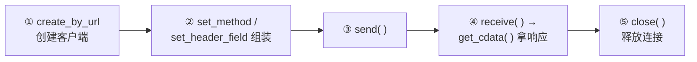
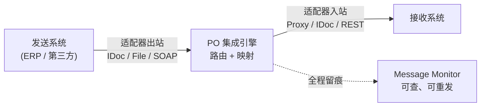
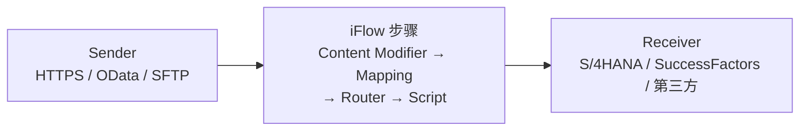

# 第16课：调用外部接口 —— REST / SOAP / PO / CPI


> 45分钟 | 阶段：高级篇 | 建议边读边做

## 前置依赖

- [第9课](09-function-module.md)：RFC 概念；
- [第13课](13-oo-basic.md)：类与方法的调用；
- [第8课](08-formatting.md)：字符串处理。

## 问题引入

SAP 不是孤岛：汇率在第三方 API 上、物流状态在合作方系统里、公众号推送要走微信接口。ABAP 怎么伸手到 HTTP 世界？返回的 JSON 怎么变成 ABAP 结构？这节课把 **REST 调用五步法**打通，并鸟瞰 SOAP / PO / CPI 三位"老大哥"的位置——知道每类集成该选哪条路。

!!! warning "环境差异：外网与 SSL 是前置条件"

    Demo 调用公网汇率 API（`open.er-api.com`）。要求：① 试用容器所在主机能访问外网；② STRUST 里已导入目标站点的 SSL 证书（或先用 `ssl_id = 'ANONYM'` 试，证书报错时按第0课的 STRUST 方法导入 `open.er-api.com` 证书链）；③ 公司内网需代理。跑不通不影响学习——代码与流程讲解完整，环境问题本身就是本课知识点。

## 时间安排

| 时段 | 内容 | 时长 |
|------|------|------|
| 场景引入 | 集成版图：四条路各管什么 | 3 分钟 |
| Demo 跟做 | 实时汇率换算票价全流程 | 8 分钟 |
| 代码拆解 | HTTP 五步 / JSON 解析 / 异常与超时 | 23 分钟 |
| 知识总结 | PO/CPI 概览、集成选型表、排查清单 | 8 分钟 |
| 课后思考 | 练习 | 3 分钟 |

## 本课目标

完成本课你将能够：

- 用 `cl_http_client` 完成 GET 请求的五步流程（创建→组装→发送→接收→关闭）；
- 用 `/ui2/cl_json` 把 JSON 反序列化进自定结构；
- 说清 REST / SOAP / PO / CPI 的定位与选型；
- 按清单排查外部调用失败（网络/证书/代理/超时）。

## Demo：实时汇率换算票价（分步跟做）

SE38 运行 `zac_rest_api`（已随仓库下发）：

```abap
REPORT zac_rest_api.

START-OF-SELECTION.
  DATA: lo_http TYPE REF TO if_http_client,
        lv_json TYPE string.

  " 1. 创建 HTTP 客户端
  " SSL_ID 的类型是 SSFAPPLSSL，直接传字面量部分系统会报 "not type-compatible"；
  " 'ANONYM' 对应 STRUST 的 "SSL Client Anonymous" PSE（'DFAULT' 则是 Standard PSE）
  DATA lv_ssl_id TYPE ssfapplssl VALUE 'ANONYM'.

  cl_http_client=>create_by_url(
    EXPORTING
      url    = 'https://open.er-api.com/v6/latest/USD'
      ssl_id = lv_ssl_id
    IMPORTING
      client = lo_http
    EXCEPTIONS OTHERS = 4 ).
  IF sy-subrc <> 0.
    WRITE: / 'HTTP 连接创建失败（检查网络/SM59/SSL）'. EXIT.
  ENDIF.

  " 2. 组装 GET 请求
  lo_http->request->set_method( 'GET' ).
  lo_http->request->set_header_field(
    name  = 'Accept' value = 'application/json' ).

  " 3. 发送与接收
  lo_http->send( EXCEPTIONS OTHERS = 1 ).
  IF sy-subrc <> 0.
    WRITE: / '请求发送失败'. lo_http->close( ). EXIT.
  ENDIF.
  lo_http->receive( EXCEPTIONS OTHERS = 1 ).
  IF sy-subrc <> 0.
    WRITE: / '响应接收失败（外网/防火墙/SSL 证书，见课文环境提示）'.
    lo_http->close( ). EXIT.
  ENDIF.

  lv_json = lo_http->response->get_cdata( ).
  lo_http->close( ).

  WRITE: / |响应前 200 字: {
    COND string( WHEN strlen( lv_json ) > 200
                 THEN substring( val = lv_json len = 200 )
                 ELSE lv_json ) }|.

  " 4. JSON 解析：按需声明字段，工具类按名自动映射
  TYPES: BEGIN OF ty_rates,
           cny TYPE string,
           jpy TYPE string,
         END OF ty_rates.
  TYPES: BEGIN OF ty_result,
           result    TYPE string,
           base_code TYPE string,
           rates     TYPE ty_rates,
         END OF ty_result.

  DATA(ls_result) = VALUE ty_result( ).
  /ui2/cl_json=>deserialize(
    EXPORTING
      json        = lv_json
      pretty_name = /ui2/cl_json=>pretty_mode-none
    CHANGING
      data        = ls_result ).

  " 5. 查票价并换算
  SELECT SINGLE price FROM sflight
    WHERE carrid = 'AA' AND connid = '0017'
    INTO @DATA(lv_price_usd).

  IF ls_result-rates-cny IS NOT INITIAL.
    DATA(lv_rate) = CONV f( ls_result-rates-cny ).
    WRITE: / |原始票价: { lv_price_usd } USD|.
    WRITE: / |实时汇率: 1 USD = { lv_rate } CNY|.
    WRITE: / |换算票价: { lv_price_usd * lv_rate NUMBER = USER } CNY|.
  ELSE.
    WRITE: / '未能解析到 CNY 汇率（检查网络与 JSON 结构）'.
  ENDIF.
```

**你会看到什么：** 成功时先打印一段原始 JSON（亲眼看看接口返回长什么样），随后三行输出 USD 原价、实时汇率、换算价。失败时按提示排查——每条失败提示对应"环境提示"框里的一个原因。

## 知识点

### 1. 集成版图：四条路各管什么

| 通路 | 定位 | 什么时候用 |
|------|------|-----------|
| **REST（本课）** | ABAP 直连 HTTP API | 轻量、点对点、自己可控两端 |
| **SOAP WebService** | XML 协议 + WSDL 契约 | 对接老系统/银行，契约先行 |
| **SAP PO** | 本地集成中间件（ES/BPM） | 大企业内部多系统总线、IDoc/代理混跑 |
| **SAP CPI** | 云端集成（iFlow 流程） | BTP 时代的 PO，云到云/云到地 |

**选型直觉：** 简单直连走 REST；对方只给 WSDL 就 SOAP；需要监控/映射/重试的中间层治理就上 PO/CPI（集成平台不是开发偷懒，是运维治理）。

### 2. HTTP 五步法（背下来）



- **GET vs POST**：GET 参数在 URL、取数据；POST 带请求体（`set_cdata` 放 JSON）、交数据。本课 GET；POST 差异只在②多一步设 body 和 Content-Type；
- **认证**：API Key / Bearer Token 都是加一个 Header：`set_header_field( name = 'Authorization' value = |Bearer { lv_token }| )`；
- **SM59 的角色**：`create_by_url` 适合临时/简单场景；生产更常用 `create_by_destination`（SM59 里配 G 类型目标）——URL/代理/证书集中管理，改配置不改代码。

### 3. JSON ↔ ABAP：/ui2/cl_json

```abap
/ui2/cl_json=>deserialize(          " JSON → ABAP
  EXPORTING json = lv_json
             pretty_name = /ui2/cl_json=>pretty_mode-none
  CHANGING  data = ls_result ).

/ui2/cl_json=>serialize(            " ABAP → JSON（POST 出参用）
  EXPORTING data = ls_request compress = abap_true
  RECEIVING r_json = lv_json_out ).
```

- **按需建结构**：你关心哪些字段就在 `TYPES` 里声明哪些——工具类按字段名匹配填充，多余 JSON 字段自动忽略；
- `pretty_name` 决定命名风格转换（camelCase 接口常用 `pretty_mode-camel_case`；本例 JSON 键带下划线，用 `none` 精确匹配）；
- 数据源侧还有 `xco`（ABAP Cloud）/ `cl_sxml` 等新工具，7.52 时代 `/ui2/cl_json` 是最顺手的通用件。

### 4. 失败排查清单（按命中率排序）

1. **容器/主机没外网**：公司代理或防火墙——Basis 配代理（SM59 目标或 icman 参数）；
2. **SSL 证书**：报 `SSL unknown`/证书错——STRUST 导入目标站证书链（第0课同样操作）；
3. **HTTP 状态码**：`lo_http->response->get_status( )` 拿 code：401 认证、404 路径、5xx 对方故障——**看状态码再谈别的**；
4. **超时**：`lo_http->send` 前可设 `PROPERTYTYPE_LOGON_TIMEOUT` / 在 SM59 目标里配——外部挂了不能拖死你的工作进程；
5. **JSON 结构变了**：打印原始响应前 200 字（Demo 里有）再对照解析结构。

### 5. SOAP 一分钟

SOAMANAGER 发布/消费 WebService：消费侧本质是"按 WSDL 生成代理类 → 调代理方法"，XML 的组装解析全部由框架代劳。SOAP 项目里你几乎不碰 XML 字符串——那是它对比手工 HTTP 的最大优点；缺点是重、慢、调试绕。

### 6. SAP PO 概览：企业内部的集成总线

PO（Process Orchestration）是 SAP 的**本地部署集成中间件**：当"系统 A 直连系统 B"的点对点接口多到失控，就在中间架一条总线——所有消息经过 PO 做路由、映射、监控、重试。ABAP 开发者在 PO 项目里的典型角色：写被 PO 调用的**代理类（Proxy）**，或收发 **IDoc**——中间件本身由集成团队维护，你负责两头。

**组件地图（记住五个字母）：**

| 组件 | 全称 | 干什么 |
|------|------|--------|
| **SLD** | System Landscape Directory | 登记"公司里有哪些系统、装了什么版本"——一切配置的底座 |
| **ESR** | Enterprise Services Repository | 设计态：定义接口结构（Message Type）与字段映射（Message Mapping） |
| **ID** | Integration Directory | 配置态：这条消息从哪个系统来、走哪个通道、到哪去 |
| **IE / AEX** | Integration Engine / Advanced Adapter Engine | 运行态：历史双栈版本里 IE 在 ABAP 栈跑消息、AEX 在 Java 栈跑适配器（File/JDBC/SOAP/IDoc…）；PO 7.5 起为 Java 单栈，运行核心是 AEX + BPM |
| **BPM** | Business Process Management | 跨系统流程编排（如"订单→校验→审批→发货"跨三个系统串起来） |



**IDoc 收发流程（ABAP 侧必须会）：** IDoc 是 SAP 自家的标准消息格式，三段结构——控制记录（`EDIDC`：谁发给谁、什么类型）、数据记录（业务字段按段存）、状态记录（走到哪一步）。

1. **出站**：程序/消息控制生成 IDoc → 按 `WE20` 合作伙伴参数找端口（`WE21` 定义，常用 tRFC）→ 状态 `03`（已送出端口）；
2. **入站**：收到 IDoc → `WE20` 决定处理模块 → 状态 `53`（过账成功）或 `51`（应用错误）；
3. **排查三件套**：`WE02` 看 IDoc 内容与状态、`BD87` 重处理失败单、`SM58` 看 tRFC 卡在哪。

> 集成项目里最常见的一幕：业务说"单子没过去"，你在 `WE02` 里看到状态 51，双击错误消息，定位到字段映射或主数据缺失——十分钟结案。

### 7. SAP CPI 概览：云时代的 iFlow

CPI（Cloud Platform Integration，现名 **Cloud Integration**，属 BTP Integration Suite）是 PO 思想的云端版本：SAP 托管租户、浏览器里画图开发、免 Basis 运维。核心概念是 **iFlow（Integration Flow）**——一张画布：



- **步骤积木**：Content Modifier（改报文头/体）、Mapping（图形化字段映射，思路与 PO 一脉相承）、Router（条件分支）、Groovy/JavaScript Script（兜底自由度）；
- **适配器接两端**：HTTPS、OData、SOAP、IDoc、SFTP、JMS……连 SAP 云产品（SuccessFactors / Ariba / Concur）有大量**官方预打包 iFlow**，从 SAP Business Accelerator Hub 下载、改参数即可上线；
- **开发即 Web**：设计、部署、监控（Message Monitoring）全在浏览器，没有 SM59 / STRUST 那套——但思想同源：连接、映射、监控、重试。

**PO vs CPI 一表选型：**

| 维度 | SAP PO | SAP CPI |
|------|--------|---------|
| 部署 | 客户本地机房（自己运维） | BTP 云租户（SAP 运维） |
| 开发工具 | ESR / ID 客户端（老牌但重） | 浏览器 Web UI |
| 典型场景 | 企业内部老系统总线、IDoc / File 密集 | 云 SaaS 集成、云到地混合 |
| 复用资产 | 历年自建映射 | 官方预打包 iFlow 内容库 |
| 趋势 | 存量巨大、新增减少 | SAP 官方战略方向 |

**一句话：** 老系统还在机房，PO 就还在跑；新项目只要沾一朵云，默认先看 CPI——而你写的 ABAP（Proxy / OData / IDoc）在两边是同一套接法。

## 💡 实战经验

!!! tip "生产环境走 SM59 Destination"

    URL 硬编码在代码里 = 改环境要改代码。`create_by_destination` + SM59 配置，DEV/QAS/PROD 各自指向，代码零改动。

!!! tip "外部调用要设超时 + 兜底"

    外部接口的平均可用性远低于你的想象。默认超时、失败降级（用上次缓存汇率 + 提示"汇率非实时"）是负责任的写法。

!!! tip "调接口前先打印原始响应"

    解析为空九成是结构与 JSON 对不上。Demo 里那行"响应前 200 字"请保留习惯——十秒定位映射问题。

## 📖 延伸阅读

- [ABAP Keyword Documentation](https://help.sap.com/doc/abapdocu_752_index_htm/7.52/en-US/index.htm)——`IF_HTTP_CLIENT` / JSON 章节；
- [SAP Help Portal](https://help.sap.com) 搜 "CPI" / "Process Orchestration"——两位中间件的官方文档；
- [abap_fm_json 深度解析——把 ABAP 函数模块暴露成 HTTP 服务](https://jack-liang.com/blog/abap-fm-json-in-depth-analysis/)（作者博客）——本课是"调别人的服务"，这篇是反向：把自己的 FM 提供成 HTTP/JSON 服务。

## 课后思考

> 把你的回答写在**页面底部评论区**，注明题号，一起讨论。

1. 五步法里 `close( )` 忘了会怎样？（提示：连接是系统资源）
2. 把 Demo 改成 POST：请求体 `{"base":"USD"}` 发给一个你找得到的公开 POST 接口（或本地 mock）——`set_cdata` 之外还需要设哪个 Header？
3. 汇率解析用 `pretty_mode-none` 精确匹配——如果接口字段是 `baseCode`（驼峰），ABAP 结构字段该怎么声明、pretty_name 用哪个模式？
4. 你负责的接口要同时给三个系统用，选 REST 直连还是 PO/CPI 中间层？列出你的判断依据。
5. 业务报"单子没过去"，你在 `WE02` 里看到 IDoc 状态 51——接下来的排查顺序是什么？（提示：本课"排查三件套"）

---

下一课：[第17课：Transport Request（请求与传输）](17-transport.md)
