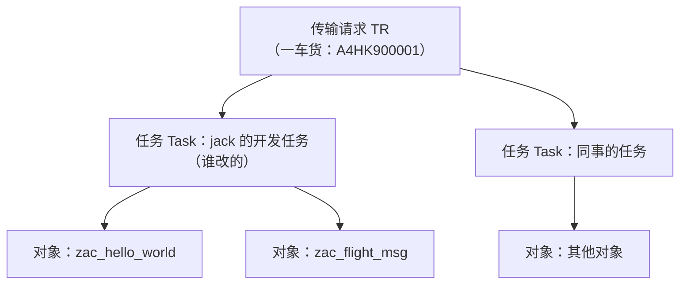

# 第17课：Transport Request（请求与传输）

> 45分钟 | 阶段：高级篇 | 操作 + 流程课

## 前置依赖

- 前面课程已开发过一批对象（程序、表、消息类——它们都是"待运输的货物"）。

## 问题引入

你在开发系统（DEV）写好了 20 个对象，怎么"搬"到测试（QAS）和生产（PRD）？手工复制既不现实也不合规。SAP 的答案是**传输请求（Transport Request，TR）**：每一次对象变更都被自动记录归集，打包成请求，沿 DEV → QAS → PRD 的路线受控投放。这是 SAP 世界"发布"的形态——与 Git 分属两个维度：**TR 管"部署到哪个系统"，Git 管"代码版本历史"**（第23课两线合流）。

!!! warning "环境差异：单容器没有多系统"

    试用镜像是一个单机系统，看不到真实的三系统景观与 STMS 导入队列。本课在镜像里能完整练习**创建请求、看对象清单、释放**；导入到另一系统的环节按"流程+截图"理解，到公司环境即插即用。

## 时间安排

| 时段 | 内容 | 时长 |
|------|------|------|
| 场景引入 | 代码从 DEV 到 PRD 的旅程 | 3 分钟 |
| Demo 跟做 | 请求的一生：创建→收集→释放 | 12 分钟 |
| 知识讲解 | 请求/任务结构、类型、STMS、最佳实践 | 22 分钟 |
| 知识总结 | 传输检查单、常见故障 | 5 分钟 |
| 课后思考 | 练习 | 3 分钟 |

## 本课目标

完成本课你将能够：

- 说清"请求 vs 任务"、"Workbench vs Customizing 请求"两组概念；
- 在 SE09 中创建/查看/释放传输请求，读懂请求里的对象清单；
- 解释释放顺序（先任务后请求）与导入前置条件；
- 按最佳实践组织请求（一个功能一个请求、依赖齐全、带描述）。

## Demo：请求的一生（分步跟做）

### 步骤 1：触发一个请求

1. SE38 随便改一个课程程序（如 `zac_hello_world` 加一行注释）并保存；
2. 弹出 **Create Transport Request** 对话框（因为课程包不是本地包）→ 给个简短描述：`课程演示: hello world 注释更新` → 确认；
3. 系统生成形如 `A4HK900001` 的**请求号**，对象变更记录在**你名下的任务**里。

### 步骤 2：SE09 检阅

1. 进 SE09（Transport Organizer），看 **Own Requests / User** 视图——你的请求树：请求下面挂任务，任务下挂对象；
2. 展开对象列表：能看到刚才那个程序的条目（类型 PROG）；
3. 双击对象能跳到对象；双击请求进**属性页**（可改描述、看目标系统）。

<!-- 配图（待截图后启用）： -->

### 步骤 3：释放

1. 先释放**任务**（子节点：右键 → Release）——任务释放时系统检查对象语法、写入版本库；
2. 再释放**请求**（父节点）——此时请求进入"可导入"状态，变更从开发缓冲区落成传输包。

**你会看到什么：** 释放后请求状态变"已释放"（卡车图标）。单容器系统到此为止；多系统景观里，STMS 的 QAS 导入队列会出现这个请求，等 Basis/负责人导入。

## 知识点

### 1. 层级结构：请求 → 任务 → 对象

- **请求是车，任务是货架，对象是货物**：多人协作同一请求时各自的任务分开记账；
- 释放顺序铁律：**先所有任务、再请求**（任务未释放，请求释不了）。

### 2. 两种请求

| 类型 | 装的是什么 | 事务码 |
|------|-----------|--------|
| **Workbench Request** | 开发对象：程序、表、类、CDS、增强…… | SE09/SE01 |
| **Customizing Request** | 配置数据：SPRO 里的定制、SM30 维护的表内容 | SPRO/SE09 |

课程里产生的全是前者；第12课导入的自定义表数据若要带走，属于"表数据传输"话题（SM30 配置 `zac_flight_ext` 的维护视图 + 记录到 Customizing 请求）。

### 3. 请求命名规范建议

请求号（`A4HK900001`）由系统按号段生成，你改不了——团队规范落在**描述**上。常见做法是描述前缀编码：

| 前缀示例 | 含义 |
|----------|------|
| `ZFLT_D01` | 项目 ZFLT 的**开发类**（Workbench）请求，第 01 号 |
| `ZFLT_C01` | 项目 ZFLT 的**定制类**（Customizing）请求，第 01 号 |

也可以是 `项目前缀_模块_序号`（如 `ZSD_BILL_03`）。价值一句话：**STMS 导入队列一屏几十辆车，前缀让 Basis 和你一眼认出哪车是哪个项目的、装的什么类别**。命名与描述的分工：前缀负责"归类与检索"，冒号后的短句负责"这车具体干了什么"——合起来形如 `ZFLT_D01 | FIX: 订单报表金额列重复 #CR1234`。

!!! tip "先问团队规范，再自创"

    多数公司已有成文规范（甚至 Basis 配置了描述格式检查）。进项目第一天先问，别让 SE09 列表里混着三种风格。

### 4. 传输路线与 STMS

- 三系统景观：DEV →（释放后）→ QAS 导入队列 → 测试通过 → PRD 导入（通常需审批）；
- **STMS**（Transport Management System）：Basis 的总控台——传输路由、域、导入队列；开发者的视野通常止步于"释放"；
- 单系统/容器环境：释放的请求躺在 `usr/sap/trans` 的数据目录里，没有下游系统来取——但流程与真实环境完全一致。

### 5. 依赖：货没装全会怎样

目标系统导入时报"对象不存在/激活失败"——车开到了，零件没上。典型依赖坑：

- 程序引用的消息类/表/FM 没进同一辆车（**跨请求依赖**：FM 在另一个未释放的请求里）；
- DDIC 对象顺序：**Domain → Data Element → Table** 的依赖在传输里自动按层排序，但"漏装"救不了；
- 检查手段：SE09 里看对象清单是否齐全；导入日志（STMS → 请求 → Log）看缺谁。

### 6. 请求锁定与冲突处理

对象一旦写进任务就被**锁定**：别人想改同一对象，系统直接拦下（"对象已在请求 XXX 中被锁定"）——这是防止两人并行改同一程序的最后防线。同事已把同一对象收进他的请求时，你有三条路：

1. **解锁**：SE03 → Unlock Objects（或 SE09 里右键）强行放行——慎用，等于拔掉保险丝，两人的版本可能互相覆盖；
2. **收编**：把你的对象并进他的请求（或把他的并进你的），一个功能一辆车——归属清晰，一起走；
3. **沟通排期**：各走各的请求，但约好谁先释放谁先导入——传输是"后到覆盖先到"，顺序即胜负。

请求**释放后对象自动解锁**，其他人才改得动。想看谁锁了什么：SE03（Objects in Requests）或 SE09 请求树里逐对象查。

!!! warning "收车前搜一遍锁"

    最佳实践一句话：**一个功能一个请求；释放前先用 SE03 搜一遍相关对象的锁定情况**。发现别人锁着同一对象，先沟通再动手——比在 QAS 里发现互相覆盖便宜得多。

### 7. 最佳实践清单

1. **一个功能一个请求**：混合大包是回退灾难（第14课"批量"思想在发布层的投影）；
2. **描述写清需求/工单号**：`FIX: 订单报表金额列重复计算 #CR1234`——三年后还能看懂；
3. **依赖同车**：新 FM + 调用方程序一个请求，或保证 FM 的请求先行；
4. **别绕过 QAS**：直传生产是合规红线；
5. **释放前看一眼对象清单**：顺手把测试垃圾对象带进生产的经典事故源。

## 💡 实战经验

!!! tip "$TMP 的东西永远出不了门"

    本地包（`$TMP`）对象不进请求——第0课建课程包时"别选本地包"的原因现在闭环了。发现对象传不出去，先查它挂在哪个包。

!!! tip "改标准对象会进 Repair 请求"

    手滑改了 SAP 标准对象（有修改授权时），变更会记入 Repair 任务，升级时冲突——正常开发永远不该看到这种请求，出现即回滚检查。

!!! tip "传完在目标系统冒烟测试"

    导入成功 ≠ 功能正常。目标系统跑一遍核心事务（哪怕就跑一次 `zac_hello_world`）再报完工——传输日志绿了只是"装上了"。

## 📖 延伸阅读

- [SAP Help Portal](https://help.sap.com) 搜 "Transport Management System"——官方传输体系文档；
- [ABAP Keyword Documentation](https://help.sap.com/doc/abapdocu_752_index_htm/7.52/en-US/index.htm)——Change & Transport System 章节。

## 课后思考

> 把你的回答写在**页面底部评论区**，注明题号，一起讨论。

1. 释放顺序为什么必须"先任务后请求"？任务释放那一刻系统做了什么？
2. 你的程序在 QAS 导入后跑不起来，报"消息类 zac_flight_msg 不存在"——用本课知识复原事故原因与预防手段。
3. Workbench 与 Customizing 请求装的东西有何本质不同？各自的典型"货主"是谁？
4. 对比思考：Git 管"版本"，TR 管"部署"——举一个两者必须配合才能正确工作的场景（提示：第23课的 abapGit + 传输双轨）。

---

下一课：[第18课：消息处理（Message Class）](18-message-class.md)
