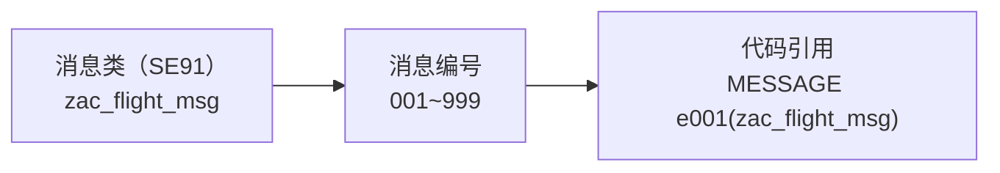

# 第18课：消息处理（Message Class）

> 45分钟 | 阶段：高级篇 | 建议边读边做

## 前置依赖

- [第7课](07-selection-screen.md)：`AT SELECTION-SCREEN` 校验里已经用过 MESSAGE；
- [第3课](03-data-dictionary.md)：建过表、走过"激活 + 传输"流程——消息类（SE91）同属仓库对象，生命周期一模一样。

## 问题引入

提示文字硬编码在程序里："请输入航空公司代码"散落 30 处，客户说要中英双语——改到吐血。**消息类**把提示文本集中管理：一条消息 = 消息类 + 编号，文本住在 SE91 里可多语言维护，代码只引用编号。这也是第7课校验、第14课 BAPI RET2 背后共同的"消息体系"——今天把它收编。

## 时间安排

| 时段 | 内容 | 时长 |
|------|------|------|
| 场景引入 | 硬编码提示的维护成本 | 3 分钟 |
| Demo 跟做 | 建消息类（仓库已带）→ 三种场景用消息 | 10 分钟 |
| 代码拆解 | 消息五类型 / WITH 占位 / INTO 内联 / RAISING | 24 分钟 |
| 知识总结 | 消息类型行为表 | 5 分钟 |
| 课后思考 | 练习 | 3 分钟 |

## 本课目标

完成本课你将能够：

- 在 SE91 创建消息类、维护消息（占位符 &1~&4）与翻译；
- 按场景选对消息类型（S/E/W/I/A/X）并预判其行为；
- 用 `WITH` 填占位、`MESSAGE ... INTO` 内联接文本；
- 在 FM 里用 `RAISING` 把消息变成异常出口。

## Demo：三种消息场景（分步跟做）

消息类 `zac_flight_msg`（含 5 条消息）已随仓库下发，SE91 打开对照：

| 编号 | 文本 |
|------|------|
| 001 | 航空公司代码 &1 不存在 |
| 002 | 航班已满，无法预订 |
| 003 | 预订成功：&1-&2-&3 |
| 004 | 查询完成，共 &1 条记录 |
| 005 | 数据已导出至 &1 |

SE38 运行 `zac_message`：

```abap
REPORT zac_message.

PARAMETERS: p_carrid TYPE s_carr_id OBLIGATORY.

" 场景①：输入校验——E 类型拦截
AT SELECTION-SCREEN ON p_carrid.
  SELECT SINGLE carrid FROM scarr INTO @DATA(lv_check)
    WHERE carrid = @p_carrid.
  IF sy-subrc <> 0.
    MESSAGE e001(zac_flight_msg) WITH p_carrid.
  ENDIF.

START-OF-SELECTION.
  " 场景②：成功提示——S 类型状态栏轻提示
  SELECT COUNT(*) FROM sflight
    WHERE carrid = @p_carrid
    INTO @DATA(lv_count).
  MESSAGE s004(zac_flight_msg) WITH lv_count.

  " 场景③：文本内联接收——不弹出、拿字符串自己用
  SELECT SINGLE * FROM sflight INTO @DATA(ls_f)
    WHERE carrid = @p_carrid AND connid = '0017'.
  IF sy-subrc <> 0.
    MESSAGE e002(zac_flight_msg) INTO DATA(lv_msg).
    WRITE: / lv_msg.
  ELSE.
    WRITE: / |航班 { ls_f-carrid }-{ ls_f-connid }|.
    WRITE: / |已占/最大: { ls_f-seatsocc }/{ ls_f-seatsmax }|.
    WRITE: / |票价: { ls_f-price }|.
  ENDIF.
```

**跟做三步：**

1. 输入 `ZZ` 执行 → 字段旁红字"航空公司代码 ZZ 不存在"，弹回选择屏幕（E 的拦截行为）；
2. 输入 `AA` 执行 → 状态栏绿字"查询完成，共 N 条记录"（S 的轻提示行为）；
3. 看列表输出：若 0017 无数据，"航班已满，无法预订"以**普通文本**出现在列表里——`INTO` 把消息变成字符串，不弹不拦。

## 知识点

### 1. 消息体系三层



- 每条消息文本 ≤ 约 70 字符，占位符最多 4 个（`&1`~`&4`）；
- **多语言**：SE91 里维护译文（登录语言决定显示哪套）——硬编码永远做不到；
- 消息类是可传输对象（第17课的货物之一）。

### 2. 六种消息类型的行为差异（重点）

| 类型 | 视觉 | 行为 | 典型场景 |
|------|------|------|---------|
| **S** | 状态栏 | 不中断，继续执行 | 成功/完成提示 |
| **I** | 弹窗 | **暂停**，用户确认后继续 | 需要用户知晓的重要信息 |
| **W** | 弹窗 | 暂停，可回车继续（再次执行不再拦） | 数据异常警告 |
| **E** | 状态栏红字 | **中断当前处理**，返回上一屏 | 校验失败（第7课主用） |
| **A** | 弹窗 | **终止**当前 LUW，回登录/初始 | 严重不一致 |
| **X** | 无 | **产生 SHORT DUMP** | 程序员级错误（调试用） |

**选型直觉：** 校验用 E、成功用 S、确认用 I、警告用 W；A/X 面向致命场景，业务代码罕见。

!!! tip "E 在不同上下文的行为差异"

    同一条 E：在选择屏幕校验里=弹回改输入（第7课）；在报表逻辑里=中断并回显；在 `MESSAGE ... INTO` 里=只取文本不中断。**类型决定行为，上下文决定表现形式**——理解这句，消息体系就通了。

### 3. 占位与内联

```abap
MESSAGE e001(zac_flight_msg) WITH p_carrid.            " &1 = p_carrid
MESSAGE s003(zac_flight_msg) WITH 'AA' '0017' '20260730'.  " &1&2&3

MESSAGE e002(zac_flight_msg) INTO DATA(lv_msg).        " 文本进变量：
" 不显示、不中断——用于拼日志、喂给 BAL、收集批量错误
```

`INTO` 是"消息的静音模式"：批量处理收集错误文本（第12课导入日志的正规做法）全靠它。

### 4. 通用形式与动态消息

```abap
" 完整形式（能看到四个系统变量的真身——第14课 RET2 的 ID/NUMBER 就是它们）
MESSAGE ID sy-msgid TYPE sy-msgty NUMBER sy-msgno
        WITH sy-msgv1 sy-msgv2 sy-msgv3 sy-msgv4.

" 自由文本消息（不需要消息类，原型期用；正式代码回到消息类）
MESSAGE '该航班暂无预订记录' TYPE 'I'.
```

任何 FM/BAPI 执行后，系统消息都留在 `sy-msg*` 四件套里——RET2 的本质就是"把这套东西对象化打包"。

### 5. FM 里的 RAISING：消息即异常出口

```abap
FUNCTION zac_xxx.
  ...
  IF lv_not_found = abap_true.
    MESSAGE e001(zac_flight_msg) WITH iv_carrid RAISING not_found.
  ENDIF.
ENDFUNCTION.
```

一条语句同时完成"触发消息 + 抛经典异常"——调用方 `EXCEPTIONS not_found = 1` 接住（第9课闭环）。这是老 FM 代码里最常见的信息出口写法。

### 6. BADI / 增强 / User Exit 里的消息红线

增强代码运行在标准程序的怀里，这里写消息有一条红线：**不要在流程中间 `MESSAGE ... TYPE 'E'`**。E 会把整条 LUW 拦腰打断——前台是弹模态框挡住用户，后台/接口场景则没人可弹，批量接口直接整批暴毙；而且回滚范围由标准程序的流程决定，你控制不了。推荐姿势是"只产文本、不抢方向盘"：`MESSAGE ... INTO` 收文本，交给日志（BAL）或约定的返回参数（BAPIRET2 风格，第14课）；确实需要拦下时，走增强点预留的异常或出口参数（`RAISING`、`cv_error = 'X'` 这类约定），把"拦不拦"的决定权还给标准流程。

```abap
" 错误姿势：增强里直接 E——批量接口调用时整条 LUW 暴毙
IF lv_check_failed = abap_true.
  MESSAGE e001(zac_flight_msg) WITH lv_carrid.
ENDIF.

" 推荐姿势：INTO 收文本 → 攒进返回表/日志，由调用方决定如何呈现
IF lv_check_failed = abap_true.
  MESSAGE e001(zac_flight_msg) WITH lv_carrid INTO DATA(lv_msg).
  APPEND VALUE bapiret2( type = 'E' id = 'ZAC_FLIGHT_MSG' number = '001'
                         message = lv_msg ) TO ct_return.
ENDIF.
```

一句话记法：**增强里消息只负责"产生文本"，"呈现与中断"永远交给外层流程。**

## 💡 实战经验

!!! tip "消息文本也是"配置"，也要走传输"

    改 SE91 文本 = 改可传输对象，进 Customizing/Workbench 请求。别在 QAS/PRD 上"顺手改一下"——环境漂移从一条改过的提示开始。

!!! tip "占位符别超过 4 个，文本别塞业务逻辑"

    一条消息表达一件事；把整段报错细节塞消息文本的，翻译和检索都会痛不欲生。细节走日志（BAL），消息只留人话。

!!! warning "W 类型的"回车继续"会骗人"

    W 按回车后第二次同样操作不再拦——用户习惯性回车连按，警告形同虚设。真正要拦的用 E，W 只用于"知情后放行"。

## 📖 延伸阅读

- [ABAP Keyword Documentation](https://help.sap.com/doc/abapdocu_752_index_htm/7.52/en-US/index.htm)——`MESSAGE` 条目（六种类型的完整语义表）；
- 消息类对象见仓库 `src/zac_flight_msg.msag.xml`——abapGit 视角的消息类形态。

## 课后思考

> 把你的回答写在**页面底部评论区**，注明题号，一起讨论。

1. S/I/W/E 四种类型各自"中断吗？弹哪？回哪？"——不看表格复述一遍。
2. `MESSAGE ... INTO` 解决什么问题？给第12课导入程序的错误日志用上它（贴代码）。
3. 把消息 003（预订成功）补上第 4 个占位符 `&4`（座位号）——SE91 里怎么改、代码里怎么传？
4. `sy-msgid/msgty/msgno/msgv1~v4` 与 BAPIRET2（第14课）是什么关系？

---

下一课：[第19课：新语法专题](19-new-syntax.md)
