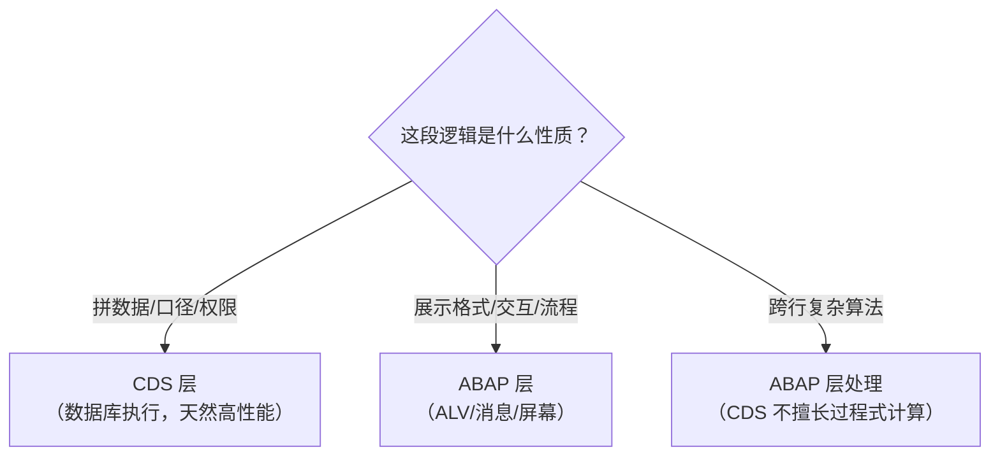

# 第21课：CDS View（进阶）—— 聚合、参数与访问控制

> 45分钟 | 阶段：现代开发篇 | 建议边读边做

## 前置依赖

- [第20课](20-cds-basic.md)：View Entity 基础、ADT Data Preview；
- [第5课](05-open-sql.md)：GROUP BY / 聚合。

## 问题引入

明细视图有了，管理层要的是"每家航空公司多少航班、平均票价多少"的**统计口径**——这类口径会被十几个报表/接口反复使用，必须固化成资产。本课给课程库添加**参数化统计视图** `zac_flight_stats`，并揭开上节课留的悬念：`#CHECK` 等待的 **DCL 访问控制**是什么、为什么说它是 CDS 的安全门。

## 时间安排

| 时段 | 内容 | 时长 |
|------|------|------|
| 场景引入 | 从明细到统计口径的需求升级 | 3 分钟 |
| Demo 跟做 | 参数化统计视图 + 带参消费 | 10 分钟 |
| 代码拆解 | 聚合/参数/Session 变量/DCL | 25 分钟 |
| 知识总结 | CDS 能力地图 | 4 分钟 |
| 课后思考 | 练习 | 3 分钟 |

## 本课目标

完成本课你将能够：

- 写带 `WITH PARAMETERS` 的聚合 CDS 并按参数消费；
- 使用标量函数、`CASE`、`$session` 变量增强视图表达；
- 说清 DCL 的作用与 `#CHECK`/`#NOT_REQUIRED` 的差别；
- 用"下推"思维判断逻辑该放 CDS 还是 ABAP。

## Demo：参数化统计视图（分步跟做）

课程库的 `zac_flight_stats`（`src/zac_flight_stats.ddls.asddls`）：

```sql
@AccessControl.authorizationCheck: #CHECK
@EndUserText.label: '航班统计视图'
define view entity ZAC_FLIGHT_STATS
  with parameters p_carrid : abap.char(3)
  as select from sflight
    inner join scarr on sflight.carrid = scarr.carrid
{
    key sflight.carrid,
    count(*)              as flight_count,
    @Semantics.amount.currencyCode: 'currcode'
    sum(sflight.price)    as total_price,
    avg( cast( sflight.price as abap.dec( 15, 2 ) ) as abap.dec( 15, 2 ) ) as avg_price,
    sum(sflight.seatsmax) as total_seats,
    sum(sflight.seatsocc) as total_occupied,
    scarr.currcode
}
where sflight.carrid = $parameters.p_carrid
group by sflight.carrid, scarr.currcode
```

**观察三个设计点：**

1. `with parameters p_carrid : abap.char(3)`——视图自带入参，统计口径"按公司"被编码进对象；
2. WHERE 里 `$parameters.p_carrid` 引用参数——数据库执行时就过滤，不是查回来再筛；
3. `sum(price)` 与 `avg(price)` 的待遇不同：sum 的结果仍是 CURR，视图实体要求金额必须带货币参考（`@Semantics.amount.currencyCode`），因此联出 `scarr.currcode` 并入 GROUP BY（carrid 的函数依赖，不拆组）；AVG 的默认结果类型是 FLTP，而 CURR 不允许转 FLTP，必须写成 `avg( cast( price as abap.dec(15,2) ) as abap.dec(15,2) )`——先把参数转 DEC，再让 AVG 返回 DEC；
4. 上节课 Demo 误把 seatsmax 也分了组（同一公司不同机型会被拆成多行），那是 GROUP BY 的经典陷阱：**分组键多一个，口径就碎一层**。

**消费端**（demo 程序 `zac_cds_advanced` 已随仓库下发）：

```abap
REPORT zac_cds_advanced.

START-OF-SELECTION.
  " 参数化 CDS：调用时传参，语法像函数
  SELECT * FROM zac_flight_stats( p_carrid = 'AA' )
    INTO TABLE @DATA(lt_stats).

  IF lines( lt_stats ) > 0.
    READ TABLE lt_stats INTO DATA(ls_stats) INDEX 1.
    WRITE: / |航空公司: { ls_stats-carrid }|.
    WRITE: / |航班数量: { ls_stats-flight_count }|.
    WRITE: / |平均票价: { ls_stats-avg_price }|.
    WRITE: / |总占座/总座位: { ls_stats-total_occupied }/{ ls_stats-total_seats }|.
  ELSE.
    WRITE: / '未找到统计数据'.
  ENDIF.
```

ADT 里 Data Preview 参数化视图时会弹参数输入框——先在预览里试不同 carrid，再写程序。

## 知识点

### 1. CDS 函数工具箱

| 类别 | 常用 | 示例 |
|------|------|------|
| 聚合 | `count(*) / sum / avg / min / max` | `sum(sflight.price) as total_price` |
| 标量 | `cast / division / coalesce / concat_with / upper / substring` | `division(total_occupied, total_seats, 2) as occupancy` |
| 日期 | `dats_add_days / dats_days_between` | `dats_days_between(sflight.fldate, $session.system_date)` |
| 条件 | `case when ... then ... else ... end` | 见下 |

```sql
case
  when sflight.seatsocc >= sflight.seatsmax then 'FULL'
  else 'OPEN'
end as flight_status
```

CDS 里没有 IF 语句——条件一律 CASE（第8课 COND 的 SQL 版）。

### 2. Session 变量：数据库层的"sy-"系列

```sql
where sflight.created_by = $session.user
  and sflight.fldate >= $session.system_date
```

`$session.user`（当前用户）、`$session.system_date`（当日）等在**数据库执行时**求值——与 ABAP 的 sy-uname/sy-datum 对应，但求值发生在下推的 SQL 里。用途：行级数据归属过滤、快照口径。

### 3. DCL：CDS 的访问控制（悬念揭晓）

第20课 `@AccessControl.authorizationCheck: #CHECK` 的含义：**有配套 DCL 就执行检查**。DCL（Data Control Language）是独立的一类对象（ADT 里 New → DCL / 事务码无经典对应）：

```sql
@MappingRole: true
define role ZAC_FLIGHT_DATA {
  grant select on ZAC_FLIGHT_DETAIL
    where (carrid) = aspect pfcg_auth(S_CARRID, CARRID, ACTVT = '03');
}
```

- 语义：谁能读这个视图的**哪些行**，由 PFCG 权限对象（S_CARRID）决定——权限不过滤"功能入口"，直接过滤"数据行"；
- **消费端无法绕过**：ABAP 任何 SELECT 走这个视图，DCL 都在数据库层执行——比"程序里自己查权限再 WHERE"可靠得多；
- 没有 DCL 时：`#CHECK` 视为放行；`#NOT_REQUIRED` 声明"此视图无需 DCL"（纯技术视图用它，消掉激活警告）。

### 4. View Entity 能力补充

上节课已切换到 View Entity 写法，它相对老 `define view` 的红利：无中间 SQL 视图命名负担、更多函数（如上面部分标量/日期函数）、更好的检查。7.55 以下系统只有老写法——**看到 `@AbapCatalog.sqlViewName` 就知道是老项目**。

### 5. `$self`：RAP 世界的"自身"（看得懂即可）

大纲把 `$self` 列在 View Entity 名下，严格说它住在隔壁：**`$self` 是 RAP 行为定义（BDL）的关键字**，指代"当前实体自身"——第23课预告的 RAP 世界的词。两个高频现身位置：action 的返回类型 `result [1] $self`（动作执行完把实体自己返回给界面），以及 `side effects` 里 `$self affects ...`（本实体发生增删改后触发前端刷新）。

```sql
" BDL 片段（行为定义，不是 CDS DDL）——认得出即可
action ApproveOrder result [1] $self;
side effects {
  $self affects field _Item.TotalPrice;
}
```

课程终点在 CDS，RAP 只是眺望——遇到 `$self` 知道"这是实体在指自己"就够，不必现在会用。顺带认全 `$` 前缀家族：`$parameters`（本课）、`$session`（第 2 节）、`$node`（CDS 层级视图专用）、`$self`（RAP BDL）——都是框架保留词，认脸即可。

### 6. 下推思维：逻辑放哪层



**判断口诀：能下推尽下推，聚合过滤优先 CDS；展示与流程永远 ABAP。**第5课"别把几百万行拉回 ABAP 再 REDUCE"的教训，在这里变成架构原则。

## 💡 实战经验

!!! tip "口径资产化"

    "平均票价"这类统计口径一旦被两个以上报表使用，就固化成 CDS——口径只在视图里活一次，月末对不上数的排查范围从 N 个程序缩到 1 个对象。

!!! tip "GROUP BY 前先写业务定义"

    动手前用一句话写清统计口径（"每家航空公司的全部航班"），再决定分组键。分组键凭手感加字段，是统计视图最大的翻车源。

!!! warning "DCL 漏配 = 裸奔"

    `#CHECK` 只在 DCL 存在时生效；上线前清点所有对外暴露的 CDS 是否该配 DCL。涉敏感数据的视图没配 DCL，等于把门禁贴在玻璃门上。

## 📖 延伸阅读

- [ABAP Flight Reference Scenario（/DMO/）](https://help.sap.com/docs/abap-cloud/abap-rap/abap-flight-reference-scenario)——官方场景里 DCL 与参数化视图的成熟样例；
- [ABAP Keyword Documentation](https://help.sap.com/doc/abapdocu_752_index_htm/7.52/en-US/index.htm)——ABAP CDS → Data Control Language 章节。

## 课后思考

> 把你的回答写在**页面底部评论区**，注明题号，一起讨论。

1. 参数化视图的参数在什么时机生效（数据库 or 应用层）？这带来什么性能含义？
2. 把 Demo 的分组键从 carrid 改成 carrid + connid，统计口径变成了什么？哪种更接近"航线维度"的运营报表？
3. 给 `zac_flight_stats` 加一个 `occupancy`（上座率，两位小数）计算列——用哪个函数？贴出你的 DDL 片段。
4. DCL 与第7课的 PFCG 权限（VALUE CHECK/MATCHCODE）分别在什么层拦数据？为什么说 DCL 更难被绕过？

---

下一课：[第22课：OO ALV](22-oo-alv.md)
