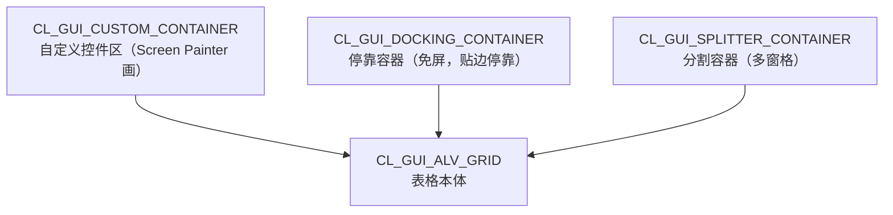

# 第22课：OO ALV —— 面向对象的 ALV

> 45分钟 | 阶段：现代开发篇 | 建议边读边做

## 前置依赖

- [第10课](10-alv-basic.md)、[第11课](11-alv-events.md)：Function ALV 的数据/字段目录/交互三板斧；
- [第13课](13-oo-basic.md)：类、方法、SET HANDLER 之前的接口概念。

## 问题引入

Function ALV 十行代码能跑，但你想要：可编辑单元格、自定义工具栏按钮、双击事件直接进你的方法、表格和表单同屏联动——REUSE 那套回调机制开始捉襟见肘。**OO ALV（`cl_gui_alv_grid`）**把 ALV 变成真正的对象：容器装它、事件处理器挂它、方法调它——第13课的 OO 功课在这里兑现为完全的掌控力。

## 时间安排

| 时段 | 内容 | 时长 |
|------|------|------|
| 场景引入 | Function ALV 的天花板 | 3 分钟 |
| Demo 跟做 | 运行 zac_oo_alv：停靠式 ALV + 三类事件 | 10 分钟 |
| 代码拆解 | 容器体系 / Grid 核心 / 事件注册 / 工具栏 | 25 分钟 |
| 知识总结 | Function vs OO ALV 终极对比 | 4 分钟 |
| 课后思考 | 练习 | 3 分钟 |

## 本课目标

完成本课你将能够：

- 说清容器（Container）体系与"Grid 必须住在容器里"的从属关系；
- 用 Docking Container 免屏实现"选择屏幕 + ALV 同屏"；
- 用 `set_table_for_first_display` 展示数据、注册 `SET HANDLER` 处理三类事件；
- 通过 TOOLBAR 事件追加自定义按钮并响应。

## Demo：停靠式 OO ALV（分步跟做）

SE38 运行 `zac_oo_alv`（已随仓库下发）——**选择屏幕出现的同时，底部直接挂着 ALV 表格**（这就是 Docking Container 的免屏魔法）：

```abap
REPORT zac_oo_alv.

CLASS lcl_app DEFINITION.
  PUBLIC SECTION.
    METHODS: constructor, display_data.
  PRIVATE SECTION.
    DATA: mo_container TYPE REF TO cl_gui_docking_container,
          mo_grid      TYPE REF TO cl_gui_alv_grid,
          mt_data      TYPE STANDARD TABLE OF sflight.
    METHODS:
      handle_double_click FOR EVENT double_click OF cl_gui_alv_grid
        IMPORTING e_row e_column,
      handle_toolbar FOR EVENT toolbar OF cl_gui_alv_grid
        IMPORTING e_object,
      handle_user_command FOR EVENT user_command OF cl_gui_alv_grid
        IMPORTING e_ucomm.
ENDCLASS.

CLASS lcl_app IMPLEMENTATION.
  METHOD constructor.
    " 停靠容器：直接挂在选择屏幕上，无需 Screen Painter 画屏
    mo_container = NEW cl_gui_docking_container(
                      repid     = sy-repid
                      dynnr     = sy-dynnr
                      side      = cl_gui_docking_container=>dock_at_bottom
                      extension = 200 ).
    mo_grid = NEW cl_gui_alv_grid( i_parent = mo_container ).
    SELECT * FROM sflight INTO TABLE @mt_data UP TO 50 ROWS.
    " 实例事件的每个处理器都必须各带一个 FOR <实例>，不能共用末尾一个 FOR
    SET HANDLER:
      me->handle_double_click FOR mo_grid,
      me->handle_toolbar      FOR mo_grid,
      me->handle_user_command FOR mo_grid.
  ENDMETHOD.

  METHOD display_data.
    DATA(ls_layout) = VALUE lvc_s_layo(
      zebra = abap_true cwidth_opt = abap_true ).
    DATA(lt_fcat) = VALUE lvc_t_fcat(
      ( fieldname = 'CARRID'    ref_table = 'SFLIGHT' ref_field = 'CARRID' hotspot = 'X' )
      ( fieldname = 'CONNID'    ref_table = 'SFLIGHT' ref_field = 'CONNID' hotspot = 'X' )
      ( fieldname = 'FLDATE'    ref_table = 'SFLIGHT' ref_field = 'FLDATE' )
      ( fieldname = 'PRICE'     ref_table = 'SFLIGHT' ref_field = 'PRICE' do_sum = 'X' )
      ( fieldname = 'SEATSMAX'  ref_table = 'SFLIGHT' ref_field = 'SEATSMAX' do_sum = 'X' )
      ( fieldname = 'SEATSOCC'  ref_table = 'SFLIGHT' ref_field = 'SEATSOCC' do_sum = 'X' ) ).
    mo_grid->set_table_for_first_display(
      EXPORTING is_layout = ls_layout
      CHANGING  it_outtab = mt_data it_fieldcatalog = lt_fcat ).
  ENDMETHOD.

  METHOD handle_double_click.
    READ TABLE mt_data INTO DATA(ls_row) INDEX e_row-index.
    IF sy-subrc = 0.
      MESSAGE |{ ls_row-carrid }-{ ls_row-connid } 票价 { ls_row-price }| TYPE 'I'.
    ENDIF.
  ENDMETHOD.

  METHOD handle_toolbar.
    DATA(ls_btn) = VALUE stb_button(
      function = 'ZEXPORT' icon = '@16@' quickinfo = '导出 CSV' text = '导出' ).
    APPEND ls_btn TO e_object->mt_toolbar.
  ENDMETHOD.

  METHOD handle_user_command.
    CASE e_ucomm.
      WHEN 'ZEXPORT'.
        CALL FUNCTION 'GUI_DOWNLOAD'
          EXPORTING filename = |flight_{ sy-datum }.csv| filetype = 'ASC'
          TABLES data_tab = mt_data.
    ENDCASE.
  ENDMETHOD.
ENDCLASS.

INITIALIZATION.
  " 在选择屏幕阶段挂载 ALV：屏幕出现即见表格，事件即时可交互
  DATA(go_app) = NEW lcl_app( ).
  go_app->display_data( ).
```

**跟做三步：**

1. 运行即见底部 ALV（50 行 SFLIGHT，斑马纹 + 合计）；
2. **双击任意行** → 弹窗显示"公司-航线 票价"（`double_click` 事件）；
3. 工具栏多了一个**"导出"按钮**（`toolbar` 事件追加），点击 → `user_command` 事件接到 `ZEXPORT` 功能码 → 下载 CSV。

<!-- 配图（待截图后启用）： -->

## 知识点

### 1. 容器体系：Grid 的"房子"



- **Grid 必须住在容器里**——它自己不知道往哪渲染；
- 三种容器选型：有专用屏幕（Dialog 程序/综合实战）→ Custom；想偷懒免屏 → Docking（本课）；一屏多区域 → Splitter；
- Custom Container 路线需要：Screen Painter 画屏 → 放一个 Custom Control 起名（如 `CC_ALV`）→ `container_name = 'CC_ALV'` → `CALL SCREEN 100`——第24课综合实战走这条路。

### 2. Grid 核心三方法

| 方法 | 时机 |
|------|------|
| `set_table_for_first_display` | 首次展示（Field Catalog + Layout + 数据） |
| `refresh_table_display` | 数据变了刷新（对应第11课 `rs_selfield-refresh`） |
| `set_ready_for_input( 1 )` | 进入可编辑模式（REUSE 做不到的重头戏之一） |

字段目录从 `slis_t_fieldcat_alv` 换成 `lvc_t_fcat`——字段名略不同（`cwidth_opt` vs `colwidth_optimize`），语义一致，迁移成本是"改几个字段名"。

### 3. 字段目录的捷径：LVC_FIELDCATALOG_MERGE

Demo 里手写 `VALUE` 目录是为了看清每个字段的控制项；纯展示 DDIC 表全字段时有一条捷径——让系统照着 DDIC 结构自动铺出整张目录：

```abap
DATA lt_fcat TYPE lvc_t_fcat.

CALL FUNCTION 'LVC_FIELDCATALOG_MERGE'
  EXPORTING  i_structure_name = 'SFLIGHT'   " 或传内表：i_internal_tabname
  CHANGING   ct_fieldcat      = lt_fcat
  EXCEPTIONS OTHERS           = 1.
```

- **自动生成**：列头、数据类型、输出长度全从 DDIC 抄来——字段多、字段常变的表省下一大截维护量；
- **手写（VALUE）**：自定义列头、计算列（DDIC 里不存在的列）、hotspot / do_sum / edit 逐项精调时，手写，或"先生成再 `LOOP ... MODIFY` 局部改"。

取舍一句话：**快出原型用 MERGE，要精修就手写；混合场景先 MERGE 再补改几行。**

### 4. 事件：OO 版的"回调"

```abap
" 类定义里：声明处理方法（签名由事件规定）
METHODS handle_double_click FOR EVENT double_click OF cl_gui_alv_grid
  IMPORTING e_row e_column.

" 构造里：注册（把方法挂到具体 Grid 实例上）
SET HANDLER me->handle_double_click FOR mo_grid.
```

对比第11课的字符串 FORM 名回调：**方法有了类型检查、有了封装（直接访问类属性 mt_data）、多实例多处理器随便挂**——这就是第13课"接口与实现"思想的控件版。

常用事件一览：

| 事件 | 触发 | 本课 |
|------|------|------|
| `double_click` | 双击单元格 | ✅ |
| `toolbar` | 工具栏生成时（追加按钮的机会） | ✅ |
| `user_command` | 点击功能码（含你的自定义按钮） | ✅ |
| `data_changed` | 可编辑单元格数据变更 | 进阶/实战 |
| `hotspot_click` | 热点单击 | 与双击同理 |

### 5. 自定义工具栏的两步走

1. `handle_toolbar` 里 `APPEND VALUE stb_button( function = 'ZEXPORT' icon = '@16@' ... ) TO e_object->mt_toolbar`——**在系统生成工具栏时插队追加**；
2. `handle_user_command` 里 `CASE e_ucomm WHEN 'ZEXPORT'` 响应——功能码自定义（课程规范带 Z 前缀）。

这套"TOOLBAR 追加 + USER_COMMAND 响应"对等于经典屏幕的 GUI Status，但全在类里、随对象走。

## 💡 实战经验

!!! tip "免屏原型用 Docking，正式交互用 Custom"

    快速验证数据展示，Docking + INITIALIZATION 三分钟见效；要做正式的 Dialog 交互（按钮布局、屏幕流），走 Custom Container + Screen。课程把两条路都给了样板。

!!! tip "可编辑 + data_changed 是 OO ALV 的招牌菜"

    REUSE 做不了（像样的）在线编辑。OO ALV：fcat 设 `edit = 'X'` + `set_ready_for_input` + 监听 `data_changed` 校验——Excel 式录入界面就出来了，第24课的预订编辑靠它。

!!! warning "控件编程别忘了 PBO 刷新"

    Custom Container 路线下每次 `CALL SCREEN` 的 PBO 都要判断容器是否已存在（`IF mo_container IS INITIAL` 才创建）——重复创建控件是 OO ALV 第一崩溃源（CONTROL_ERROR）。

## 📖 延伸阅读

- [ABAP Keyword Documentation](https://help.sap.com/doc/abapdocu_752_index_htm/7.52/en-US/index.htm)——`CL_GUI_ALV_GRID` / `CL_GUI_DOCKING_CONTAINER` 类文档；
- 第10课对比表：Function / SALV / OO 的选型回顾。

## 课后思考

> 把你的回答写在**页面底部评论区**，注明题号，一起讨论。

1. Grid 与容器的关系为什么这样设计？（提示：渲染位置与表格逻辑的分离，像不像第13课的接口思想？）
2. 把 Demo 的 Docking 换成右侧停靠（`dock_at_right`）、宽度 400——改哪几个参数？
3. 动手：给 `handle_double_click` 换成弹**二级 ALV**（该航班的 SBOOK 明细，参考第11课 `show_bookings`，但用 OO 方式在弹窗容器 `cl_gui_dialogbox_container` 里展示）——贴出你的方法。
4. Function ALV 与 OO ALV 各自的最佳场景是什么？你们团队的标准是哪个？

---

下一课：[第23课：BTP 概览 + abapGit](23-btp-abapgit.md)
