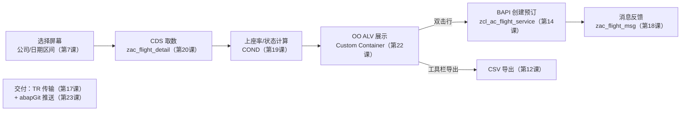

# 第24课：综合实战 —— SFLIGHT 航班管理系统（收官）


> 45分钟 | 阶段：现代开发篇 | 毕业设计

## 前置依赖

- 前 23 课全部内容——它们都是这次的积木。

## 问题引入

23 个知识点散落在 23 个 Demo 里。最后一步：把它们组装成一台**完整的机器**——选择屏幕进、CDS 取数、OO ALV 展示、双击预订（BAPI）、消息反馈、一键导出（Excel/CSV）、TR 打包、abapGit 发布。这趟走完，你就拥有了"接一个真实需求，从零交付到上线"的全流程体感——这也是课程的毕业礼。

!!! note "对象状态"

    本课的主程序 `zac_flight_manager`（含 5 个 INCLUDE 与 Screen 100）已随 abapGit 下发——Pull 即得，直接 F8 运行。数据层的 `zac_flight_detail` / `zac_flight_stats`、业务层的 `zcl_ac_flight_service`、消息类 `zac_flight_msg` 也都已在库。全套对象已在作者实机完成"导入 → 激活 → 运行 → 屏幕回写序列化"全链路验证；若你的 abapGit 版本较旧不传输 Dynpro，Screen 100 按下列要点手工补建：类型 Normal；元素 `CUST_FLIGHT`（Custom Control，拉满、勾双向 Resizing）与 OK 码字段 `OK_CODE`；流逻辑 PBO `MODULE status_0100`、PAI `MODULE user_command_0100`；GUI 状态 `STATUS_100` 绑 F3=BACK、Shift+F3=EXIT、F12=CANC（注意替换掉全功能模板的 `&` 开头占位码，并把 OK 字段命名为 `OK_CODE`）。

## 时间安排

| 时段 | 内容 | 时长 |
|------|------|------|
| 场景引入 | 从"知识点"到"产品"的思维转换 | 3 分钟 |
| Demo 演示 | 系统功能全貌走一遍 | 5 分钟 |
| 设计走读 | 架构 / Include 拆分 / 核心类 / 数据流 | 28 分钟 |
| 课程总结 | 24 课知识地图 + 后续路线 | 6 分钟 |
| 课后思考 | 毕业设计题 | 3 分钟 |

## 本课目标

完成本课你将能够：

- 用 Include 结构组织一个正式的 ABAP 应用；
- 按 MVC 思想分配职责：CDS（Model 数据）→ OO ALV（View 展示）→ 应用类（Controller 编排）；
- 复用前 23 课的资产（CDS 视图、服务类、消息类）组装完整功能；
- 走完"开发 → 传输（TR）→ 发布（abapGit）"的端到端流程。

## 系统设计

### 1. 目标功能



### 2. 对象清单（对照第0课矩阵）

```
ZAC_FLIGHT_MANAGER（主程序，已随仓库下发）
├── ZAC_FLIGHT_TOP     → 全局声明：TABLES/类型/对象引用
├── ZAC_FLIGHT_SEL     → 选择屏幕（PARAMETERS/SELECT-OPTIONS + 校验）
├── ZAC_FLIGHT_PBO     → Screen 100 PBO：容器/Grid 初始化
├── ZAC_FLIGHT_PAI     → Screen 100 PAI：OK_CODE 分发
├── ZAC_FLIGHT_FORMS   → 编排：取数/展示/预订/导出
├── zac_flight_detail  → CDS 航班详情（✅已入库）
├── zac_flight_stats   → CDS 航班统计（✅已入库）
├── zcl_ac_flight_service → 业务服务类：BAPI 封装（✅已入库）
└── zac_flight_msg     → 消息类（✅已入库）
```

**复用清单就是成绩单**：待写的只有展示层和编排层——数据层、业务层、消息层前 23 课已经备好。

### 3. 核心代码走读

> 以下代码块是设计走读用的**精简版**；完整可运行源码在仓库 `src/zac_flight_manager.prog.abap` 与各 INCLUDE（`zac_flight_top/sel/pbo/pai/forms.prog.abap`）——边读课文边对照真码，效果最佳。

**主程序 + TOP（结构骨架）：**

```abap
REPORT zac_flight_manager.

INCLUDE zac_flight_top.
INCLUDE zac_flight_sel.
INCLUDE zac_flight_pbo.
INCLUDE zac_flight_pai.
INCLUDE zac_flight_forms.
```

```abap
* ZAC_FLIGHT_TOP —— 全局声明集中在顶楼
TABLES: sflight.

DATA: go_app TYPE REF TO lcl_flight_app.   " 控制器（本程序本地类）

" 输出行结构：CDS 行 + 两个计算列
TYPES: BEGIN OF ty_flight_detail.
        INCLUDE TYPE zac_flight_detail.    " CDS 字段整建制引入（第20课）
TYPES:   status     TYPE string,
         load_factor TYPE p LENGTH 5 DECIMALS 2,
       END OF ty_flight_detail.
```

**控制器（取数 + 编排）：**

```abap
CLASS lcl_flight_app DEFINITION.
  PUBLIC SECTION.
    METHODS:
      get_data,
      display,
      create_booking IMPORTING iv_carrid TYPE s_carr_id
                               iv_connid TYPE s_conn_id
                               iv_fldate TYPE s_date,
      export_to_csv.
  PRIVATE SECTION.
    DATA: mt_data TYPE STANDARD TABLE OF ty_flight_detail WITH EMPTY KEY,
          mo_alv  TYPE REF TO lcl_alv_display.
ENDCLASS.

CLASS lcl_flight_app IMPLEMENTATION.
  METHOD get_data.
    " 数据层：CDS 视图 + 选择屏幕条件（第5/7/20课合体）
    SELECT * FROM zac_flight_detail
      WHERE carrid = @p_carrid AND fldate IN @s_date
      INTO CORRESPONDING FIELDS OF TABLE @mt_data.

    " 加工层：表达式计算状态与上座率（第19课）
    LOOP AT mt_data ASSIGNING FIELD-SYMBOL(<fs>).
      <fs>-load_factor = COND #( WHEN <fs>-seatsmax > 0
                                 THEN <fs>-seatsocc * 100 / <fs>-seatsmax
                                 ELSE 0 ).
      <fs>-status = COND string(
        WHEN <fs>-seatsocc >= <fs>-seatsmax THEN '已满'
        WHEN <fs>-load_factor > 80          THEN '紧张'
        ELSE '可订' ).
    ENDLOOP.
  ENDMETHOD.

  METHOD display.
    mo_alv = NEW lcl_alv_display( me ).           " 视图持有控制器引用，事件只做翻译
    mo_alv->set_data( mt_data ).
    mo_alv->display( ).                           " 触发 CALL SCREEN 100 → PBO 起容器
  ENDMETHOD.

  METHOD create_booking.
    " 业务层：复用第14课封装好的服务类（BAPI + RET2 + COMMIT 全在里面）
    DATA lv_msg TYPE string.
    DATA(lv_bookid) = zcl_ac_flight_service=>create_booking(
      EXPORTING
        iv_carrid   = iv_carrid
        iv_connid   = iv_connid
        iv_fldate   = iv_fldate
      IMPORTING
        ev_message  = lv_msg ).            " 失败原因（成功为空）
    IF lv_bookid IS INITIAL.
      MESSAGE lv_msg TYPE 'S' DISPLAY LIKE 'E'.
      RETURN.                              " 失败：不刷数据，用户重试
    ENDIF.
    MESSAGE ID 'ZAC_FLIGHT_MSG' TYPE 'S' NUMBER 003
      WITH iv_carrid iv_connid lv_bookid.  " 预订成功：&1-&2-&3（第18课）
    get_data( ).                           " 数据变了
    mo_alv->refresh( mt_data ).            " 视图跟着刷（第22课）
  ENDMETHOD.

  METHOD export_to_csv.
    CALL FUNCTION 'GUI_DOWNLOAD'
      EXPORTING
        filename              = |flight_{ sy-datum DATE = ISO }.csv|
        filetype              = 'ASC'
        write_field_separator = 'X'
      TABLES
        data_tab              = mt_data.
    MESSAGE ID 'ZAC_FLIGHT_MSG' TYPE 'S' NUMBER 005
      WITH |flight_{ sy-datum DATE = ISO }.csv|.  " 数据已导出至 &1（第18课）
  ENDMETHOD.
ENDCLASS.
```

**交互（示意）：** ALV 的 `double_click` 事件由视图类 handler 接住 → 读当前行 → 转发 `mo_app->create_booking( )`；工具栏 `ZEXPORT` 按钮 → `mo_app->export_to_csv( )`——事件入口只做"翻译"，业务全部交给控制器（完整实现见仓库 `src/zac_flight_forms.prog.abap`）。

### 4. 交付流程（课程的最后一公里）

1. **自测**：第6课的调试器全流程过一遍（断点在 create_booking，亲眼看 BAPI 的 RET2）；
2. **打包**：全部对象收进一个 TR（第17课：功能完整一车走），释放；
3. **发布**：abapGit stage/commit/push（第23课），CI 自动部署文档站——**你正在读的这篇课文就是这条流水线的产物**。

## 课程总结

### 24 课知识地图

| 阶段 | 课 | 你获得了什么 |
|------|-----|-------------|
| 基础 1-6 | SAP 入门 / 类型 / DDIC / 内表 / SQL / 调试 | 独立读写数据、排错的基本功 |
| 核心 7-13 | 选择屏幕 / 格式化 / FM / ALV / Excel / OO | 交付"用户能用的东西"的能力 |
| 高级 14-19 | BAPI / 增强 / 接口 / 传输 / 消息 / 新语法 | 与标准系统和外部世界协作 |
| 现代 20-24 | CDS / OO ALV / BTP / abapGit / 实战 | 面向未来的数据模型与工程化 |

### 后续学习路线

1. **真实项目**：找一个真实需求完整交付一次——胜过再看十门课；
2. **RAP + Fiori Elements**：CDS 之后的正牌续集（[/DMO/ 参考场景](https://help.sap.com/docs/abap-cloud/abap-rap/abap-flight-reference-scenario)起步）；
3. **SAPUI5 / Fiori**：前端界面开发；
4. **深化专题**：IDoc/ALE、Workflow、HANA Native SQL、ABAP Unit 测试；
5. **社区**：[SAP Community](https://community.sap.com) + [SAP Help Portal](https://help.sap.com)——遇到问题先搜这里的长期主义。

## 💡 实战经验

!!! tip "先画图再写码"

    综合项目最忌"边写边想"。先画出对象清单（像上面的树）与数据流图，每个类一句话职责——写之前它已经是设计题而不是编码题。

!!! tip "积木复用，不要重造"

    第 1-23 课的每个对象都是为今天准备的：CDS 管数据、服务类管业务、消息类管提示。检查你的设计里有没有"重写的已有积木"——有就说明架构没收干净。

!!! tip "范围控制：完整 > 完美"

    毕业设计的目的是**走通全流程**。功能闭环、流程走完、TR/Git 交付齐活，比任何单点的炫技都值钱——优化是下一个项目的事。

## 📖 延伸阅读

- [参考资料库](references.md)——全课程外部资料总索引；
- [ABAP Flight Reference Scenario（/DMO/）](https://help.sap.com/docs/abap-cloud/abap-rap/abap-flight-reference-scenario)——你的下一站。

## 课后思考（毕业设计题）

> 完成后把你的答案/作品链接贴到**页面底部评论区**——这里会留下每一届学员的脚印，我也会来点评。

1. **毕业设计**：不看参考，自己实现 `zac_flight_manager` 的展示层（Screen 100 + `lcl_alv_display`），跑通"筛选→展示→双击预订→导出"闭环；卡住或完成后，对照仓库 `src/` 里已下发的官方实现做一次重构复盘——commit 到你的 Fork 并贴出链接；
2. **扩展题**：增加"按月份票价趋势"统计页（提示：CDS 里 `dats_add_days`/日期函数 + 第21课聚合）；
3. **复盘**：24 课里你最有信心讲给别人听的是哪一课？最容易忘的是哪块？（评论区立个 flag，三个月后回来看看）
4. **展望**：如果这个系统要上 BTP（RAP 重写），哪些资产可以直接搬走，哪些必须重做？（提示：CDS 的可迁移性正是它存在的意义）

---

**课程完。** 感谢走到这里——回到[首页](index.md)看看你走过的路，评论区聊聊你的下一步。
