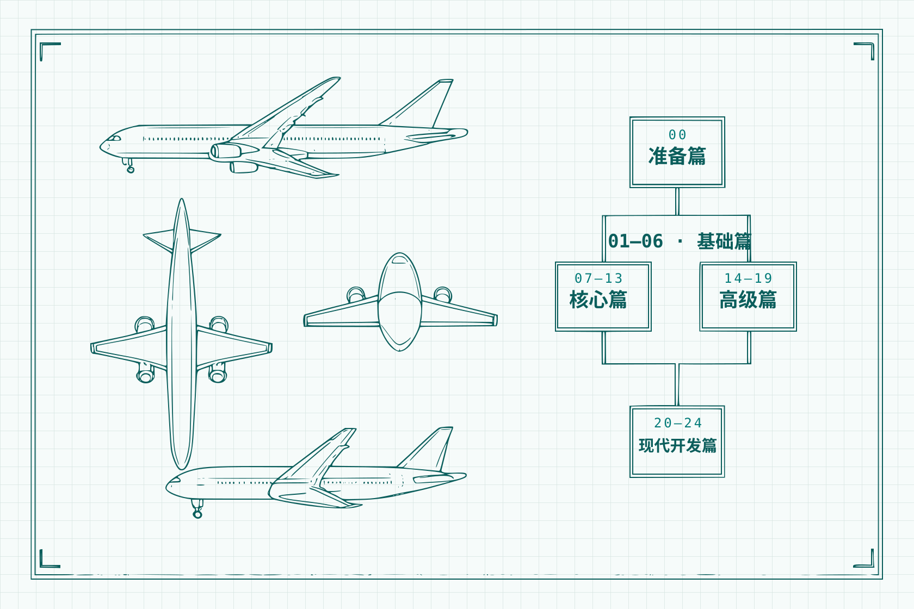

---
hide:
  - navigation
  - toc
---

<!-- 首页工程蓝图布局：进度数字由 hooks.py 构建时自动计算（{{REV_*}} 占位符），勿手改。
     注意：hero-body / cta 容器必须带 markdown="1"，否则其中的 Markdown/按钮语法不会被解析；
     深层 HTML 块内一律用内联 SVG 图标与 <code> 标签，不依赖 Markdown 渲染。 -->

<!-- ============ 工程元信息栏 ============ -->

  

    
    SAP NetWeaver 7.52 · ABAP 7.5+
  

  

    定稿 {{REV_FINAL}} 篇（{{REV_FINAL_PCT}}%）
    初稿 {{REV_DRAFT}} 篇（{{REV_DRAFT_PCT}}%）
  

<!-- ============ HERO：左叙事 · 右 CAD 图框 ============ -->
<section class="ac-hero" markdown="1">

SAP ABAP · 实战二十四课

# ABAP Course

从零开始的 SAP ABAP 现代企业级开发实战

以官方试用镜像与 <code>SFLIGHT</code> 演示数据为底座，沿五个阶段走完二十四课——从 Hello World 一路走到 CDS View 与综合航班管理系统。

[开始学习 · 第0课 :material-rocket-launch:](00-getting-started.md){ .md-button .md-button--primary }
[GitHub 仓库](https://github.com/Jack-Liang/abap-course){ .md-button }

<!-- CAD 图框 -->
<figure class="ac-cad">
  <i class="ac-cb ac-cb--tl" aria-hidden="true"></i><i class="ac-cb ac-cb--tr" aria-hidden="true"></i><i class="ac-cb ac-cb--bl" aria-hidden="true"></i><i class="ac-cb ac-cb--br" aria-hidden="true"></i>
  

    <svg class="ac-ic" viewBox="0 0 24 24" xmlns="http://www.w3.org/2000/svg" aria-hidden="true"><path d="M2 2h6v2h8V2h6v6h-2v8h2v6h-6v-2H8v2H2v-6h2V8H2zm14 6V6H8v2H6v8h2v2h8v-2h2V8zM4 4v2h2V4zm14 0v2h2V4zM4 18v2h2v-2zm14 0v2h2v-2z"/></svg>FIG.00 · SFLIGHT 数据模型
    Schematic Active
  

  

    

      
    

    Schema Verified
  

</figure>

</section>

<!-- ============ 主列 8 + 侧列 4 ============ -->

<!-- —— 课程阶段 —— -->
<section class="ac-sec" id="phases">

  

    
Stage Blueprint

    <h2 class="ac-sec__title">课程阶段</h2>
  

  

    00
    <h3>准备篇 · 环境配置</h3>
    
官方试用镜像部署、SFLIGHT 演示数据确认、abapGit 导入课程仓库。

  

  
● 已定稿<a class="ac-phase__link" href="00-getting-started.md">第0课 环境搭建</a>

  

    01 - 06
    <h3>基础篇 · 语言核心与数据字典</h3>
    
SAP GUI / ADT 入门、基本数据类型、DDIC 结构设计、内表机制、Open SQL 查询与调试器实战。

  

  
● 3 课已定稿<a class="ac-phase__link" href="01-sap-overview.md">从第1课开始</a>

  

    07 - 13
    <h3>核心篇 · 屏幕交互与报表开发</h3>
    
选择屏幕、函数模块、SALV / ALV 表格报表、Excel 导入导出与 ABAP 面向对象。

  

  
○ 初稿阶段<a class="ac-phase__link" href="07-selection-screen.md">从第7课开始</a>

  

    14 - 19
    <h3>高级篇 · 集成、增强与新语法</h3>
    
BAPI 事务处理、User-Exit / BAdI 增强、RFC/REST 外部接口、传输请求与 7.40+ 新语法。

  

  
○ 初稿阶段<a class="ac-phase__link" href="14-bapi.md">从第14课开始</a>

  

    20 - 24
    <h3>现代开发篇 · CDS 与综合项目</h3>
    
CDS View 建模、OO ALV 双向联动、BTP 云原生与全功能航班调度综合管理系统。

  

  
○ 规划与初稿<a class="ac-phase__link" href="20-cds-basic.md">从第20课开始</a>

  

    + 附录
    <h3>附录 · 参考资料与授权</h3>
    
参考资料库（外部链接集中登记）与 CC BY-NC-SA 4.0 许可声明。

  

  
开放资源库<a class="ac-phase__link" href="references.md">参考资料清单</a>

</section>

<!-- —— 快速开始 —— -->
<section class="ac-sec" id="quickstart">

  

    
Bootstrap Flow

    <h2 class="ac-sec__title">快速开始</h2>
  

  
1Step 01

  

    <h3>准备一套 ABAP 练习系统</h3>
    
推荐官方 Developer Edition 镜像（Docker 快速拉取），或连接企业内部开发沙盒。

  

  
2Step 02

  

    <h3>确认 SFLIGHT 演示数据</h3>
    
官方镜像默认预置，开箱即用。

  

  
3Step 03

  

    <h3>用 abapGit 克隆仓库</h3>
    
把课程代码导入开发包 <code>ZABAP_COURSE</code>，全课程序自动激活，详见<a href="00-getting-started.md">第0课</a>。

  

</section>

<!-- —— 源码与命名规范 —— -->
<section class="ac-sec" id="convention">

  

    
Engineering Standards

    <h2 class="ac-sec__title">源码与命名规范</h2>
  

  

    

      
课程所有自建对象统一采用 <code>zac_</code> 前缀，课号不进对象名——结构更具工程通用性，重构与复用无需重命名。

      <ul>
        <li><strong>包隔离：</strong>课件代码归于 <code>ZABAP_COURSE</code> 开发包。</li>
        <li><strong>现代语义：</strong>推荐 inline declaration 与 7.40+ 新语法。</li>
      </ul>
      
完整命名规范与课 ↔ 对象对照矩阵见<a href="00-getting-started.md#四命名规范与对象对照">第0课第四节</a>。

    

    

      
REPORT zac_demo_sflight.abapABAP 7.52

      <pre><code>REPORT zac_demo_sflight.

CLASS lcl_flight_analyzer DEFINITION FINAL.
  PUBLIC SECTION.
    TYPES: tt_sflight TYPE STANDARD TABLE OF sflight
             WITH EMPTY KEY.
    METHODS fetch_high_occupancy
      IMPORTING iv_carrid        TYPE s_carr_id
      RETURNING VALUE(rt_flights) TYPE tt_sflight.
ENDCLASS.</code></pre>
      
PREFIX: zac_*ENCODING: UTF-8

    

  

</section>

<!-- —— 侧列 —— -->
<aside class="ac-home-aside">

  

    JL
    

Jack Liang

ABAP 开发者 · 博客作者

  

  

    <a href="https://jack-liang.com" target="_blank" rel="noopener noreferrer"><svg class="ac-ic" viewBox="0 0 24 24" xmlns="http://www.w3.org/2000/svg" aria-hidden="true"><path d="M16.36 14c.08-.66.14-1.32.14-2s-.06-1.34-.14-2h3.38c.16.64.26 1.31.26 2s-.1 1.36-.26 2m-5.15 5.56c.6-1.11 1.06-2.31 1.38-3.56h2.95a8.03 8.03 0 0 1-4.33 3.56M14.34 14H9.66c-.1-.66-.16-1.32-.16-2s.06-1.35.16-2h4.68c.09.65.16 1.32.16 2s-.07 1.34-.16 2M12 19.96c-.83-1.2-1.5-2.53-1.91-3.96h3.82c-.41 1.43-1.08 2.76-1.91 3.96M8 8H5.08A7.92 7.92 0 0 1 9.4 4.44C8.8 5.55 8.35 6.75 8 8m-2.92 8H8c.35 1.25.8 2.45 1.4 3.56A8 8 0 0 1 5.08 16m-.82-2C4.1 13.36 4 12.69 4 12s.1-1.36.26-2h3.38c-.08.66-.14 1.32-.14 2s.06 1.34.14 2M12 4.03c.83 1.2 1.5 2.54 1.91 3.97h-3.82c.41-1.43 1.08-2.77 1.91-3.97M18.92 8h-2.95a15.7 15.7 0 0 0-1.38-3.56c1.84.63 3.37 1.9 4.33 3.56M12 2C6.47 2 2 6.5 2 12a10 10 0 0 0 10 10 10 10 0 0 0 10-10A10 10 0 0 0 12 2"/></svg>jack-liang.com→</a>
    <a href="https://jack-liang.com/contact/" target="_blank" rel="noopener noreferrer"><svg class="ac-ic" viewBox="0 0 24 24" xmlns="http://www.w3.org/2000/svg" aria-hidden="true"><path d="M12 4a4 4 0 0 1 4 4 4 4 0 0 1-4 4 4 4 0 0 1-4-4 4 4 0 0 1 4-4m0 10c4.42 0 8 1.79 8 4v2H4v-2c0-2.21 3.58-4 8-4"/></svg>联系作者→</a>
  

  

    Revision Metrics
    共 {{REV_TOTAL}} 课
  

  

    
    
  

  

    <i class="ac-rev-key--final"></i>定稿 {{REV_FINAL}} 课 · {{REV_FINAL_PCT}}%
    <i class="ac-rev-key--draft"></i>初稿 {{REV_DRAFT}} 课 · {{REV_DRAFT_PCT}}%
  

  <dl class="ac-rows">
    
<dt>ABAP 版本</dt><dd>NW 7.52 SP04</dd>

    
<dt>代码仓库</dt><dd><a href="https://github.com/Jack-Liang/abap-course" target="_blank" rel="noopener noreferrer">Jack-Liang/abap-course</a></dd>

  </dl>

</aside>

